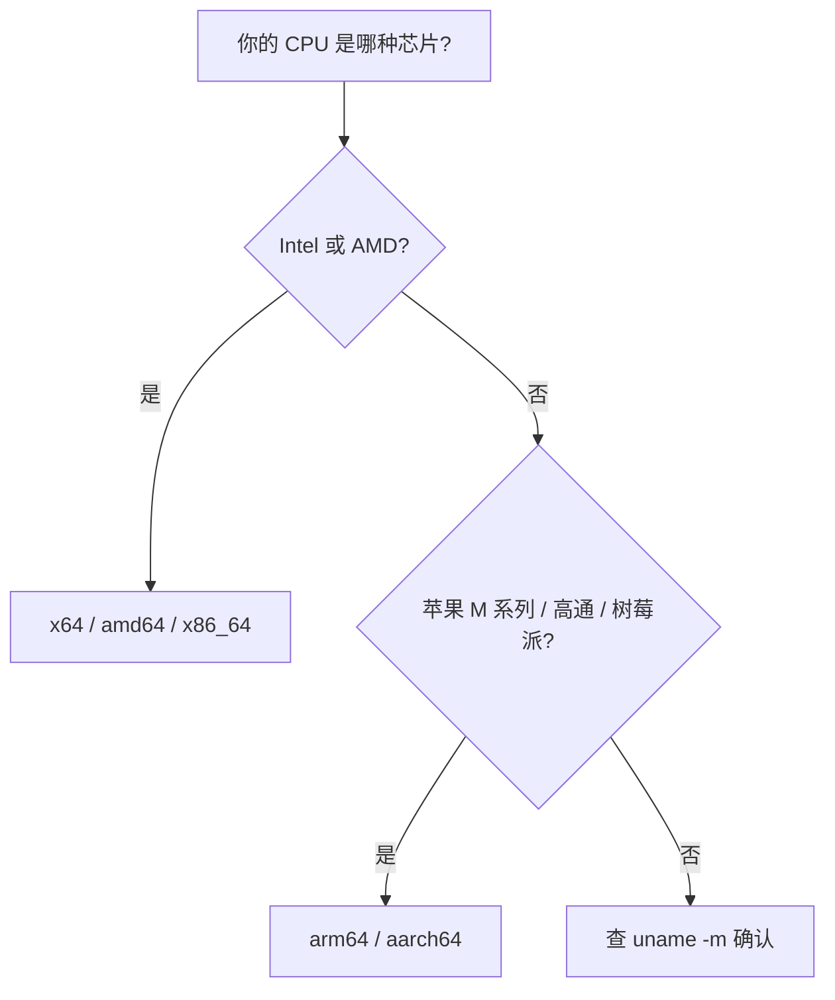
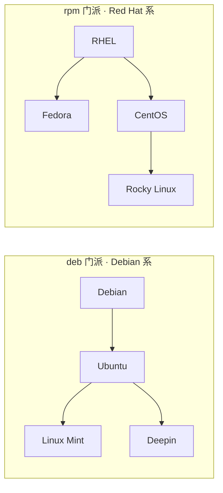
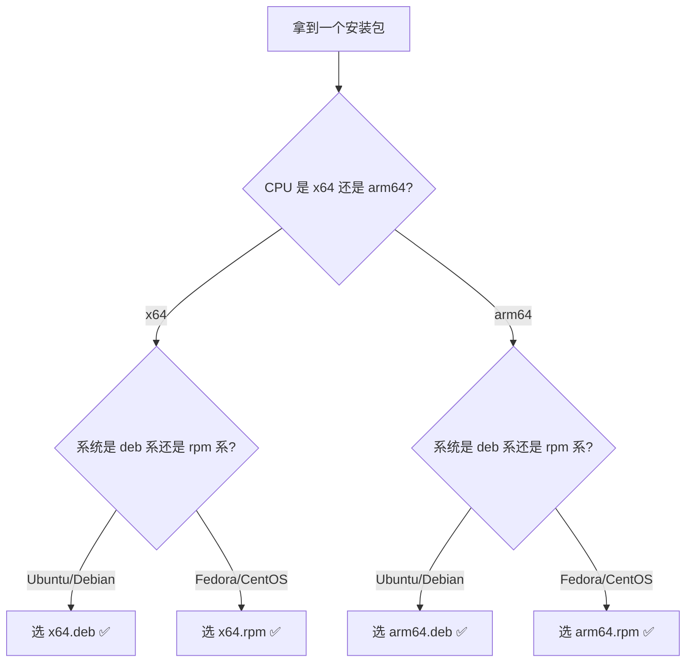

# 第 1 课 · Linux 软件包入门

> **课程目标**：搞懂 deb / rpm 是什么、x64 / arm64 是什么、怎么选对安装包。
> **学习用时**：约 15 分钟。

---

## 1. 两个维度，先分清

安装包的名字里有两种信息，它们是**独立的两个维度**：

| 维度 | 回答的问题 | 常见写法 |
|------|-----------|---------|
| **架构** | 你的 CPU 是什么芯片 | x64 / amd64 / x86_64 / arm64 / aarch64 |
| **格式** | 你的系统属于哪个门派 | deb / rpm |

**选错任何一个都会装不上。** 两个都必须匹配。

---

## 2. 架构：芯片的世界



- **x64**：Intel / AMD 的 64 位芯片。台式机、笔记本、服务器的主流，兼容性最好。
- **arm64**：ARM 架构 64 位芯片。苹果 M 系列 Mac、骁龙笔记本、树莓派、手机芯片。

> 💡 **判断命令**：终端输入 `uname -m`，输出 `x86_64` 选 x64，输出 `aarch64` 选 arm64。

---

## 3. 格式：系统的门派

Linux 世界两大门派，各自有包格式和管理器：



| 门派 | 代表系统 | 包格式 | 包管理器 | 底层工具 |
|------|---------|--------|---------|---------|
| **Debian 系** | Ubuntu、Debian、Mint、Deepin | `.deb` | `apt` | `dpkg` |
| **Red Hat 系** | Fedora、CentOS、RHEL、Rocky | `.rpm` | `dnf` / `yum` | `rpm` |

> 💡 **判断命令**：`cat /etc/os-release` 看第一行，Ubuntu / Debian → 选 deb。

---

## 4. 怎么选：一张流程图



**口诀**：架构看芯片，格式看系统。

---

## 5. 常见疑问

**Q：为什么有时看到 x86_64 和 amd64 混着用？**
A：同一个东西。x86_64 是 Intel 的命名，amd64 是 AMD 的命名，都指 64 位 x86 架构。

**Q：只有 rpm 没有 deb 怎么办？**
A：Ubuntu 下可以用 `alien` 工具转换，但这是歪路，能选 deb 优先选 deb。

**Q：为什么我的系统是 64 位的还要分 x64 / arm64？**
A：64 位 ≠ 一种架构。Intel/AMD 和 ARM 是两套完全不同的芯片设计，软件必须针对具体架构编译。

---

## 📝 课后作业

在终端运行下面两条命令，把结果写下来：

```bash
uname -m
cat /etc/os-release | head -1
```

对照本文，你的系统应该选哪种安装包？答案在下一课揭晓。

---

*上一篇：[首页](../index.md) · 下一篇：[第 2 课 · 动手安装实战](02-install-practice.md)*
