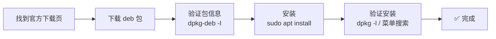
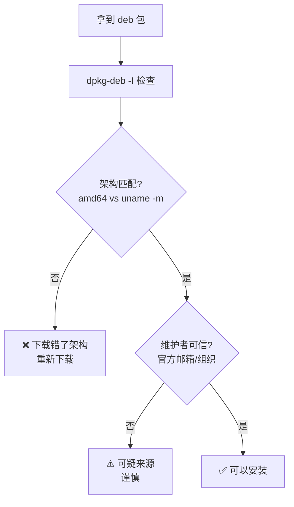
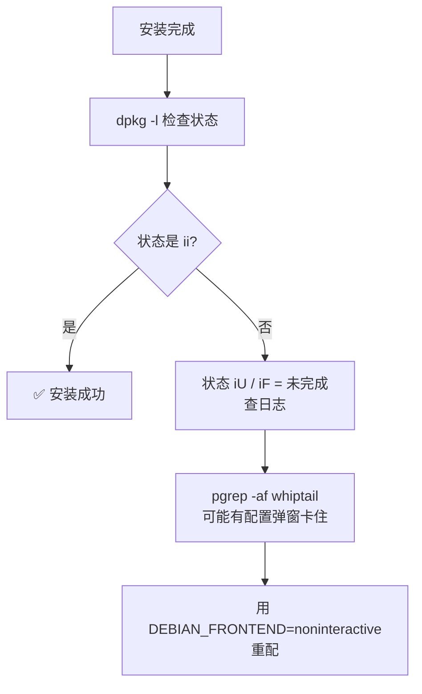

# 第 2 课 · 动手安装实战

> **课程目标**：亲手完成一个 deb 包的完整安装流程：下载 → 验证 → 安装 → 确认。
> **学习用时**：约 20 分钟（含一次真实安装）。

---

## 1. 完整流程总览



每一步都有讲究，下面逐个拆解。

---

## 2. 找到官方下载

- 优先去**软件官网**找 Linux 下载页
- 认准文件名里的 `amd64`（或 x86_64）和 `.deb`
- 例子：`google-chrome-stable_current_amd64.deb` ← 架构 + 格式都对

> ⚠️ **警惕第三方下载站**：可能捆绑广告或修改过的安装包。官网 > 官方源 > 可信镜像。

---

## 3. 验证包信息（安装前必做）

`dpkg-deb -I` 命令可以**只读**地查看 deb 包的"说明书"，不安装：

```bash
dpkg-deb -I 包名.deb | grep -E 'Package|Version|Architecture|Maintainer'
```



**检查什么**：
- **Architecture**：必须和你的 CPU 架构一致（`uname -m` 确认）
- **Maintainer**：官方维护者（如 `OpenAI <support@openai.com>`）
- **Version**：是不是最新版

---

## 4. 安装

```bash
sudo apt install ~/下载/包名.deb
```

**为什么用 apt 而不是双击或 `dpkg -i`？**

| 方式 | 自动处理依赖 | 干净卸载 | 推荐度 |
|------|:---:|:---:|:---:|
| `sudo apt install xxx.deb` | ✅ | ✅ | ⭐ 推荐 |
| `dpkg -i xxx.deb` | ❌ 缺依赖会报错 | 一般 | 不推荐 |
| 双击（软件中心） | ✅ | ✅ | 可以用 |

> 💡 apt 装 deb 会自动从仓库拉取缺失的依赖库，这是它比裸 `dpkg -i` 强的地方。

**关于 sudo 弹密码**：终端输入密码时**屏幕不显示字符**（不回显），这是正常的，直接敲完回车即可。

---

## 5. 验证安装

```bash
dpkg -l | grep 包名        # 状态 ii = 已安装
which 程序名               # 可执行文件位置
ls /usr/share/applications/ | grep -i 包名   # 桌面菜单入口
```



**两个容易困惑的点**：

1. **`which` 找不到但明明装了**：有些应用（Electron/Flutter 类，如微信、QQ、ChatGPT）可执行文件不在 PATH 里，只有桌面入口。用 `dpkg -l` + 菜单搜索确认，别被 `which` 骗了。
2. **安装卡住不动**：某些官方包（如 VS Code）安装时会弹交互式问题（"要不要添加软件源？"）。在无终端环境会卡死，`dpkg -l` 显示 `iF` 状态。解法是预置答案后重配：
   ```bash
   echo "code code/add-microsoft-repo boolean false" | sudo debconf-set-selections
   sudo env DEBIAN_FRONTEND=noninteractive dpkg --configure -a
   ```

---

## 6. 实战记录：我的三次安装

| 软件 | 架构 | 格式 | 安装方式 | 备注 |
|------|------|------|---------|------|
| Google Chrome | amd64 | deb | apt 装本地 deb | 官网下载 |
| ChatGPT 桌面版 | amd64 | deb | apt 装本地 deb | 验证了 Maintainer 是 OpenAI |
| Clash Party | amd64 | deb | apt 装本地 deb | 走镜像下载（GitHub 直连不通） |

三个都是 `amd64 + deb`——因为我的是 Ubuntu x86_64。验证了第 1 课的口诀 ✅

---

## 📝 课后作业

1. 用 `dpkg-deb -I` 检查你机器上任何一个 deb 包（比如下载目录里的），看看它的架构和维护者
2. 想想：为什么下载 Clash Party 时要用镜像（ghfast.top）？答案在下一课

---

*上一篇：[第 1 课 · Linux 软件包入门](01-package.md) · 下一篇：[第 3 课 · 为什么要用代理](03-proxy-basics.md)*
