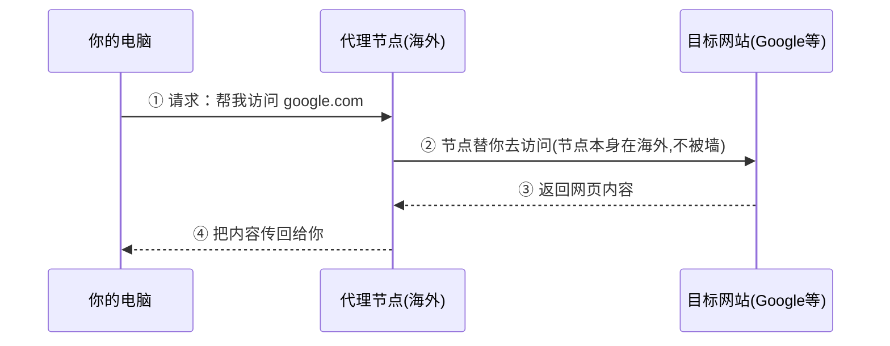
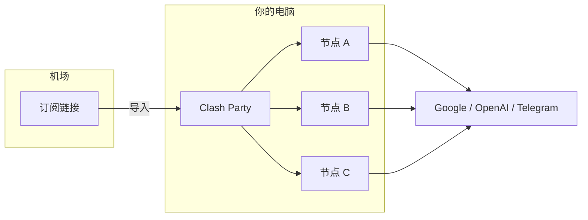
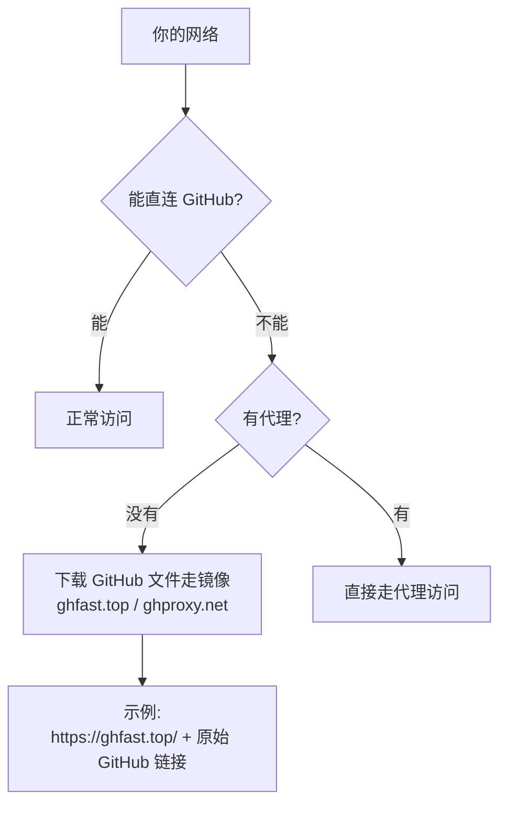
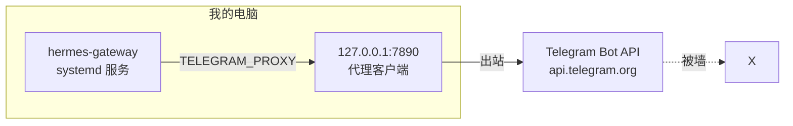

# 第 3 课 · 为什么要用代理

> **课程目标**：搞懂"梯子"的原理、核心概念、为什么你的网络需要它。
> **学习用时**：约 15 分钟。

---

## 1. 问题的起点

有些网站（Google、OpenAI、Telegram……）在中国大陆**无法直接访问**。不是技术故障，而是网络出口被限制。

于是有了**代理（Proxy）**：把你的请求先发给海外的中转服务器（节点），由它替你访问目标网站，再把结果传回来。



**关键点**：节点在海外，它访问 Google 是合法的；你只是和节点通信，而节点是你"能连上"的（节点有自己的"通道"）。

---

## 2. 核心概念表

| 概念 | 通俗解释 |
|------|---------|
| **节点** | 海外中转服务器，分布在不同国家/地区 |
| **机场** | 代理服务商。你买它的订阅，它给你节点列表 |
| **订阅链接** | 机场给的配置 URL（https:// 开头），导入客户端后自动获得节点列表 |
| **客户端** | 管理节点、转发流量的软件（Clash Party、Clash Verge、追云等） |
| **协议** | 客户端和节点之间的通信方式（Hysteria2、VLESS、Shadowsocks……） |
| **TUN 模式** | 虚拟网卡模式，接管系统全部流量，应用无感知走代理 |
| **系统代理** | 只对"支持系统代理的应用"生效（浏览器等），通过环境变量/设置生效 |



---

## 3. 节点质量决定体验

节点不是"能连就行"，几个关键指标：

| 指标 | 影响 |
|------|------|
| **地区** | 有些服务按地区限制（如 OpenAI 不支持部分地区 IP） |
| **机房类型** | 主流机房（AWS、DigitalOcean 等）更"干净"；小众/被标记机房容易被服务商拉黑 |
| **延迟** | 越低越流畅（Hysteria2 等协议优化明显） |
| **带宽** | 决定看视频、下载速度 |

> ⚠️ **真实教训**：我的 ChatGPT 登录 403 "Country not supported"，排查后发现出口节点是 **G-Core Labs** 机房——俄罗斯背景、被 OpenAI 拉黑的 IP 段。换到干净的美国/日本节点就好了。

---

## 4. 你可能会遇到的网络环境



我的情况：**GitHub 直连超时**，所以下载 GitHub 上的软件（如 Clash Party）要加镜像前缀：

```
原始链接:  https://github.com/xxx/yyy/releases/download/v1.0/app.deb
镜像链接:  https://ghfast.top/https://github.com/xxx/yyy/releases/download/v1.0/app.deb
```

---

## 5. 代理 + 网关：一个真实案例

我的 Telegram 机器人（Hermes 网关）也依赖代理：



**坑**：换了代理客户端后，端口从 7897 变成了 7890，但 `TELEGRAM_PROXY` 环境变量还指向旧端口 → 机器人 8 次重试全部失败。改回 7890 立即恢复。

> 💡 **教训**：换梯子软件后，记得检查所有依赖代理端口的配置（系统代理、环境变量、网关配置）。

---

## 📝 课后作业

1. 打开你的代理客户端，看看你的节点列表里有哪些地区？哪些是主流机房？
2. 运行 `curl -x http://127.0.0.1:7890 https://api.ip.sb/geoip`，看你的出口 IP 和地区
3. 思考：如果出口 IP 被某服务商拉黑，怎么排查？答案在 [第 6 课](06-troubleshooting.md)

---

*上一篇：[第 2 课 · 动手安装实战](02-install-practice.md) · 下一篇：[第 4 课 · Clash Party 配置指南](04-clash-party.md)*
