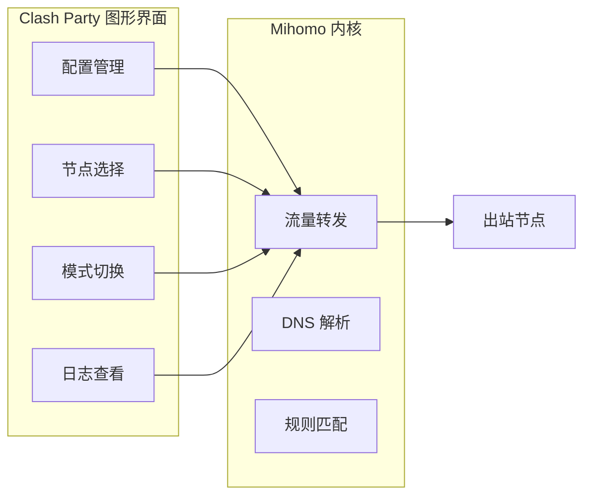
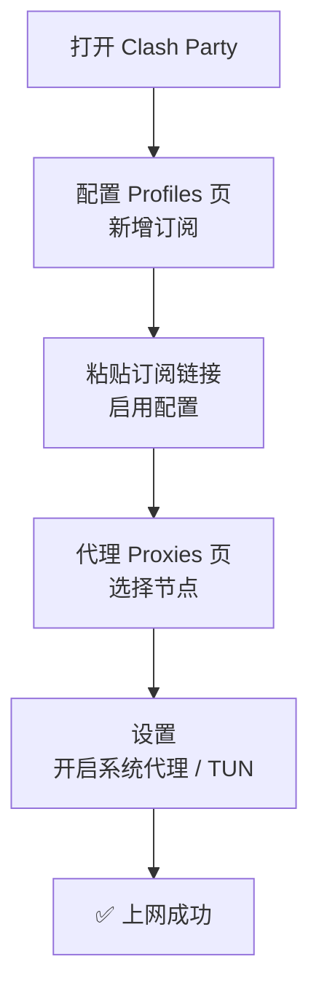
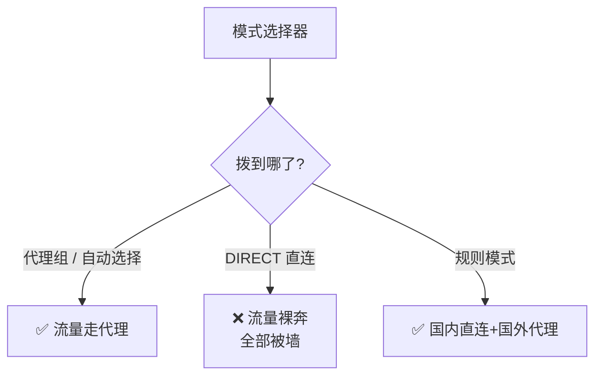
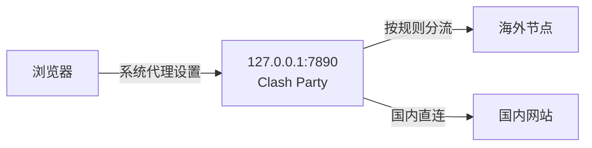
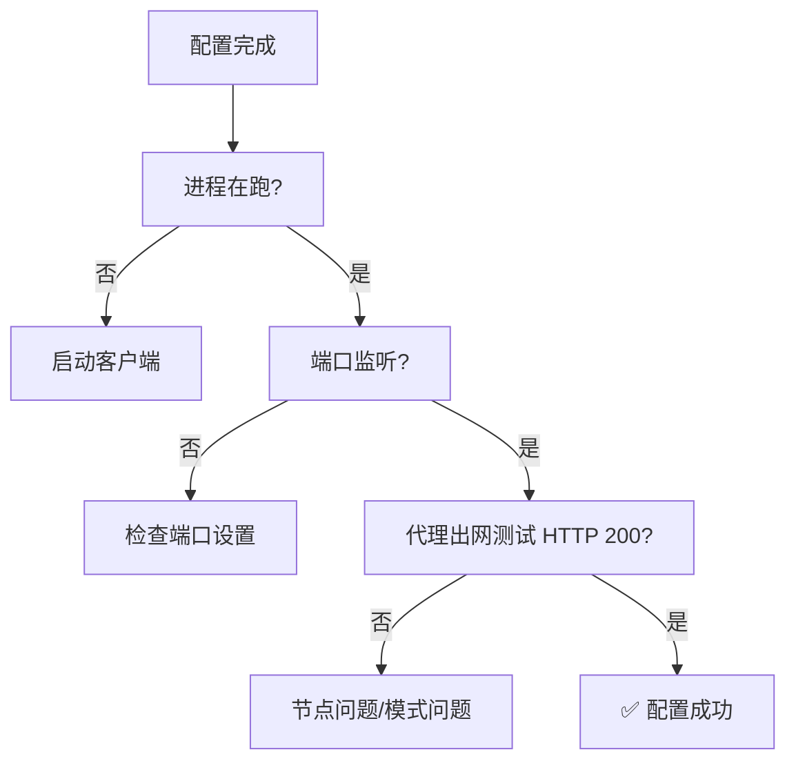

# 第 4 课 · Clash Party 配置指南

> **课程目标**：从零配置 Clash Party：导入订阅 → 选节点 → 选模式 → 开 DNS 覆写。
> **学习用时**：约 20 分钟。

---

## 1. Clash Party 是什么

Clash Party（包名 mihomo-party）是一个开源 Clash 图形客户端，基于 **Mihomo** 内核（Clash 的现代分支）。



---

## 2. 首次配置：四步走



### 第 1 步：导入订阅

1. 打开 Clash Party → 左侧 **配置（Profiles）**
2. 点 **新增** → 粘贴机场的**订阅链接**（https:// 开头，通常带 token 参数）
3. 导入后**启用**该配置，客户端自动下载节点列表

### 第 2 步：选节点

- 去 **代理（Proxies）** 页
- 优先选 **美国 / 日本 / 新加坡** 的主流机房线路
- 可以用节点测速功能（延迟越低越好）

### 第 3 步：选模式

| 模式 | 行为 | 适用场景 |
|------|------|---------|
| **规则模式 Rule** | 国内直连、国外走代理（自动分流） | ⭐ 日常推荐 |
| **全局模式 Global** | 所有流量都走代理 | 需要强制走代理时 |
| **直连 Direct** | 不走代理 | 测试 / 排除问题 |

> ⚠️ **真实踩坑**：全局模式下，模式选择器里被拨到了 **DIRECT（直连）**，国外流量在"裸奔"——以为开了梯子，其实所有请求都是直连，全被墙。检查模式选择器拨到的是**代理组**而不是 DIRECT！



### 第 4 步：开系统代理 / TUN

- **系统代理**：只影响支持系统代理的应用（浏览器等）
- **TUN 模式**：虚拟网卡，接管全部流量，所有应用无感知走代理

---

## 3. 端口与系统代理

Clash Party 默认监听本地端口（常见 7890），系统代理指向它：



**真实案例**：系统代理设置指向 **7897**（旧 Clash Verge 的端口），但新客户端监听 **7890** → 浏览器报"代理服务器地址有问题"（`curl` 返回 000）。改成 7890 后一切正常。

> 💡 **排查命令**：`ss -tlnp | grep 127.0.0.1` 看客户端实际监听哪个端口；`curl -x http://127.0.0.1:7890 https://www.google.com` 测代理通不通。

---

## 4. 验证配置成功

```bash
# 1. 进程在不在
pgrep -af -iE 'clash|mihomo'

# 2. 端口有没有监听
ss -tlnp | grep 127.0.0.1

# 3. 通过代理访问 Google
curl -x http://127.0.0.1:7890 -o /dev/null -w "HTTP %{http_code}\n" https://www.google.com

# 4. 查看出口 IP 和地区
curl -x http://127.0.0.1:7890 https://api.ip.sb/geoip
```



---

## 📝 课后作业

1. 在 Clash Party 里找到你的订阅节点数，看看有哪些地区
2. 检查系统代理设置：`gsettings get org.gnome.system.proxy.mode` 和端口
3. 用 `ss -tlnp` 确认客户端实际监听端口，和系统代理设置对齐

---

*上一篇：[第 3 课 · 为什么要用代理](03-proxy-basics.md) · 下一篇：[第 5 课 · DNS 覆写是什么](05-dns-override.md)*
