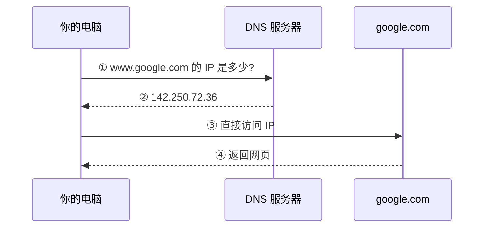
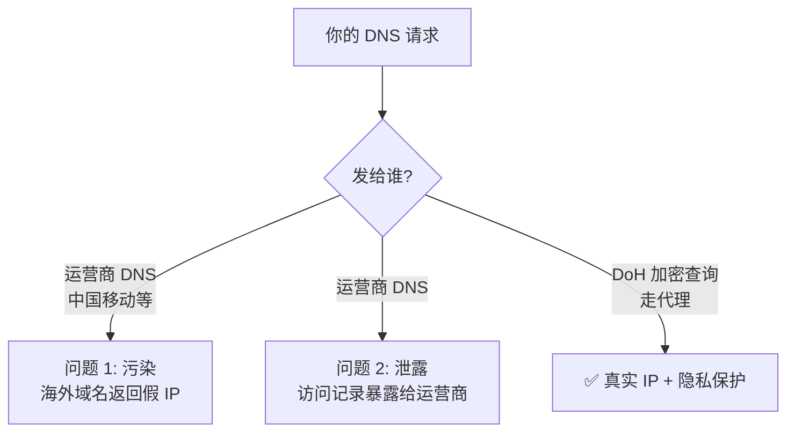
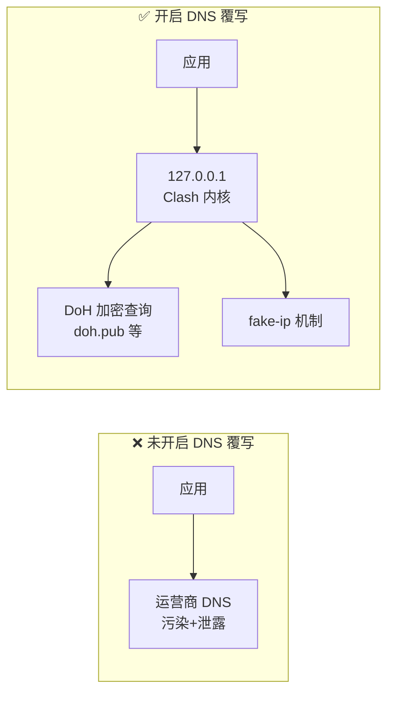
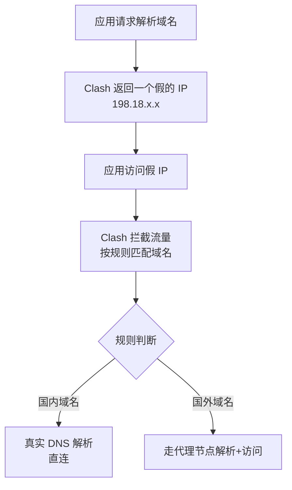
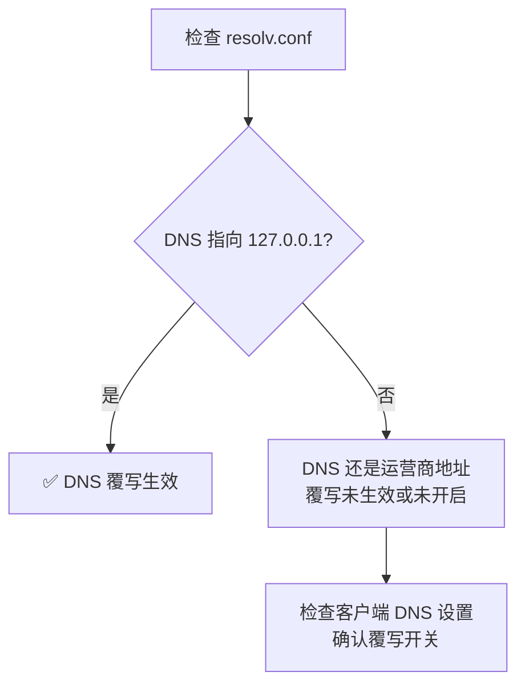

# 第 5 课 · DNS 覆写是什么

> **课程目标**：搞懂"DNS 覆写"这个开关背后的原理，以及为什么在国内网络建议开启。
> **学习用时**：约 15 分钟。

---

## 1. 先搞懂 DNS 是什么

DNS（Domain Name System）是**域名解析系统**——把人类好记的域名（`www.google.com`）翻译成机器用的 IP 地址（`142.250.72.36`）。



---

## 2. 国内网络下的 DNS 问题



**问题 1：DNS 污染**。运营商 DNS 对某些海外域名返回**篡改过的假 IP**，导致你访问的"google.com"其实是个错误地址 → 连不上或被跳转到奇怪页面。

**问题 2：DNS 泄露**。你的 DNS 查询本身会暴露"你在访问哪些域名"。更关键的是，某些服务（如 OpenAI）会根据 DNS 来源判断地区——**DNS 泄露可能触发"地区不支持"**。

---

## 3. DNS 覆写是什么

Clash 系客户端的 **DNS 覆写（Override DNS）**：打开后，客户端**接管你系统的 DNS 设置**，所有应用的域名解析请求先经过 Clash 内核处理：



开启后：
- 系统 DNS 被指向 `127.0.0.1`（客户端自己）
- 客户端用 **DoH（DNS over HTTPS，加密查询）** 向可信 DNS 服务器解析
- 结合 **fake-ip 模式** 实现按规则分流

---

## 4. fake-ip 模式

Clash Party 默认启用 **fake-ip 增强模式**：



**好处**：应用根本不需要知道真实 IP，Clash 在流量层按域名规则分流。这就是"开箱即用"的体验来源。

---

## 5. 要不要开？—— 建议：开

| 场景 | 建议 |
|------|------|
| **国内宽带 + 梯子（我的情况）** | ✅ 开。防污染、防泄露、fake-ip 分流依赖它 |
| 本地跑 AdGuard Home / Pi-hole 等 DNS 工具 | ⚠️ 可能冲突，需谨慎 |
| 需要局域网设备共享 DNS | ⚠️ 注意配置 |

**三个理由**：

1. **防 DNS 泄露** → 避免访问记录暴露 + 避免被服务商地区判定误伤
2. **fake-ip 模式依赖它** → 不开覆写，内核接管不了解析，分流失效
3. **防污染** → DoH 加密查询拿到真实 IP

> 💡 **经验**：我排查 ChatGPT 403 时，除了换节点，DNS 覆写也是预防"地区误判"的重要一环。开了它，域名解析全部走代理通道，服务商看到的解析来源是干净的。

---

## 6. 验证 DNS 是否被接管

```bash
# 查看系统 DNS 设置（开启覆写后应指向 127.0.0.1 附近）
cat /etc/resolv.conf

# 或
resolvectl status | head -20
```



---

## 📝 课后作业

1. 打开 Clash Party 的 DNS 设置，找到"DNS 覆写"开关，开启它
2. 运行 `cat /etc/resolv.conf` 看系统 DNS 变成了什么
3. 思考：fake-ip 模式下，为什么应用不需要知道真实 IP？

---

*上一篇：[第 4 课 · Clash Party 配置指南](04-clash-party.md) · 下一篇：[第 6 课 · 常见问题排查手册](06-troubleshooting.md)*
