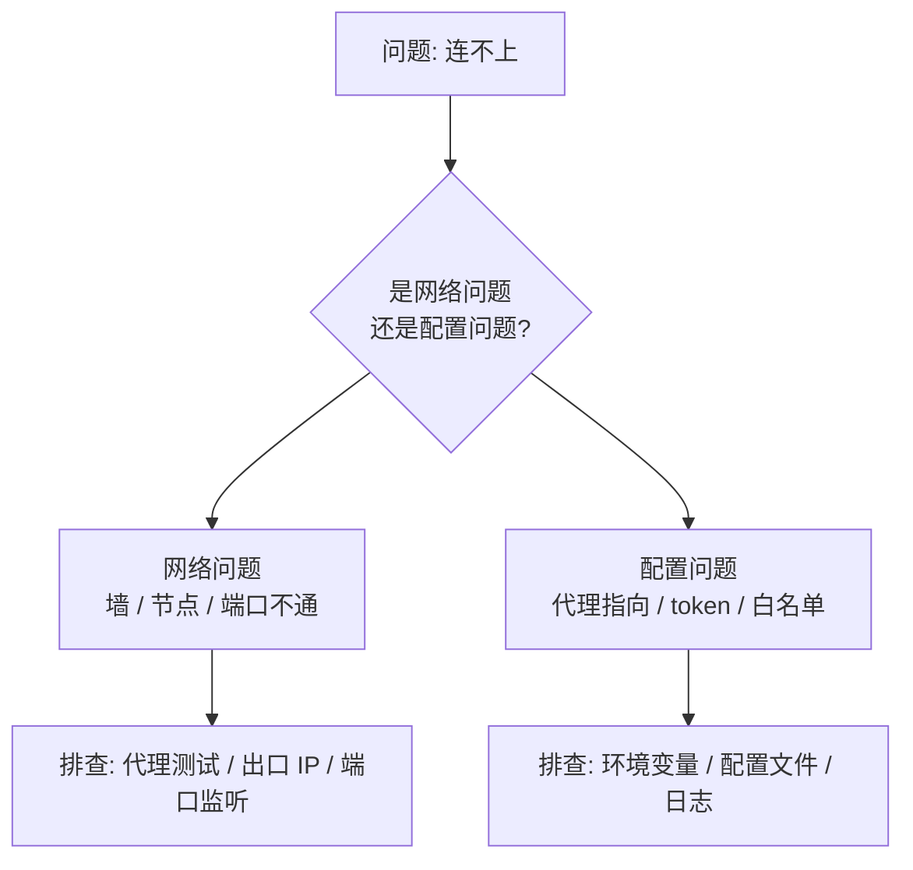
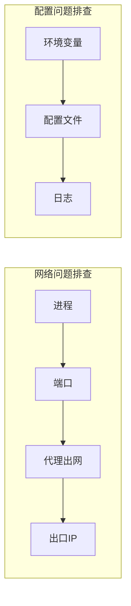
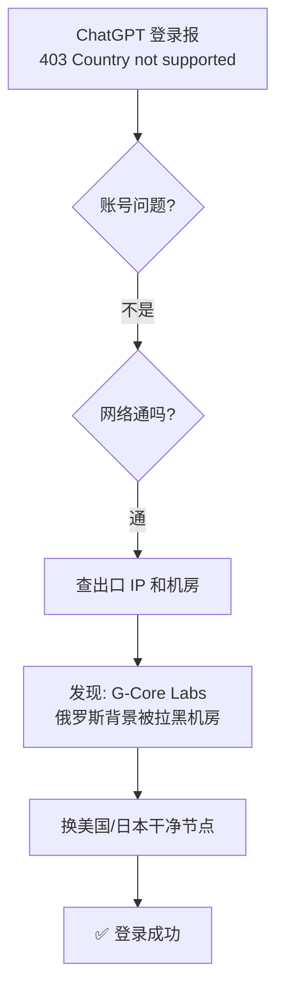
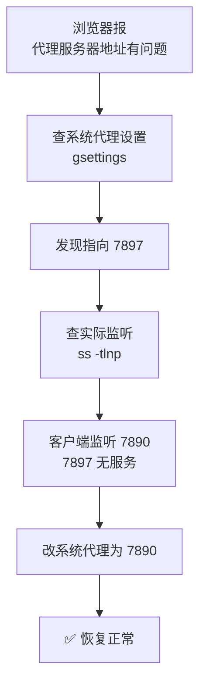

# 第 6 课 · 常见问题排查手册

> **课程目标**：掌握"上不了网 / 服务连不上"的系统性排查方法，学会用命令定位问题。
> **学习用时**：约 20 分钟。

---

## 1. 排查总纲：先分清问题类型

遇到任何"连不上"的问题，第一步不是乱试，而是**归类**：



**判断技巧**：网络问题通常表现为**超时**（timeout、000）；配置问题通常表现为**有响应但被拒绝**（401/403）。

---

## 2. 排查工具箱

```bash
# ① 进程在不在
pgrep -af -iE 'clash|mihomo'

# ② 端口有没有监听
ss -tlnp | grep 127.0.0.1

# ③ 代理出网测试（200 = 通，000 = 不通）
curl -x http://127.0.0.1:7890 -o /dev/null -w "HTTP %{http_code}\n" https://www.google.com

# ④ 直连对比（判断是不是被墙）
curl -s -m 10 -o /dev/null -w "HTTP %{http_code}\n" https://www.baidu.com

# ⑤ 出口 IP 和地区（判断节点是否干净）
curl -x http://127.0.0.1:7890 https://api.ip.sb/geoip

# ⑥ 系统代理设置
gsettings get org.gnome.system.proxy mode
gsettings get org.gnome.system.proxy.http port
```



---

## 3. 常见问题速查表

| # | 症状 | 原因 | 解法 |
|---|------|------|------|
| 1 | 浏览器报"代理服务器地址有问题" | 系统代理指向的端口没有服务在监听 | `ss -tlnp` 确认实际端口，改系统代理设置对齐 |
| 2 | ChatGPT 登录 403 "Country not supported" | 出口节点 IP 被 OpenAI 拉黑（机房段） | 换干净节点（美/日/新加坡主流机房），开 DNS 覆写 |
| 3 | Telegram 机器人连不上 | 网关环境变量 `TELEGRAM_PROXY` 指向旧端口 | 更新为当前代理端口 |
| 4 | 开了全局模式还是打不开外网 | 模式选择器拨到了 DIRECT 直连 | 切到代理组 / 自动选择 |
| 5 | 网关服务 active 但机器人不回复 | 白名单把用户消息拦截了（授权问题） | 查日志 `Unauthorized user`，修白名单 |
| 6 | GitHub 下载超时 | 直连被墙 | 用 ghfast.top / ghproxy.net 镜像 |
| 7 | 安装包报"wrong architecture" | 下载了错误的架构（arm64 装到 x64） | 确认 `uname -m`，重新下载 |

---

## 4. 案例复盘：两个真实排查

### 案例 A：ChatGPT 登录 403



**要点**：403 不是网络不通——请求**到达了** OpenAI 服务器，但服务器拒绝。拒绝原因要看出口 IP 的"身份"（机房/地区），而不是账号或密码。

### 案例 B：浏览器报代理地址有问题



**要点**：换了代理客户端，端口可能变（Clash Verge 7897 → 追云 7890 → Clash Party ?）。**任何依赖代理端口的配置都要跟着更新**：系统代理、环境变量、网关配置。

---

## 5. 日志是排查的好帮手

```bash
# Hermes 网关日志
tail -50 ~/.hermes/logs/gateway.log
tail -30 ~/.hermes/logs/errors.log

# 看关键行
grep -E 'ConnectError|TimedOut|Unauthorized|reconnected' ~/.hermes/logs/gateway.log | tail -20
```

**日志关键词对照**：

| 日志内容 | 含义 |
|---------|------|
| `ConnectError` / `TimedOut` | 网络不通（超时类）→ 网络问题 |
| `HTTP 401/403` | 凭证/地区被拒 → 配置问题 |
| `Unauthorized user: xxx` | 白名单拦截 → 授权配置问题 |
| `reconnected successfully` | 已自动恢复，无需处理 |

> 💡 **重要认知**：网关日志里出现"连接失败"**不一定要干预**——适配器会自动退避重试（8 次/轮），网络抖动会自愈。看到 `✓ reconnected successfully` 就说明恢复了，别乱改配置。

---

## 6. 排查心法

1. **先归类**：网络问题 vs 配置问题，两类解法完全不同
2. **看日志**：日志会告诉你真相（超时 = 网络，401/403 = 配置）
3. **用工具**：`ss` / `curl` / `gsettings` / `pgrep`，一条条验证
4. **别乱改**：自愈的问题（reconnected）不需要动配置
5. **记录坑**：踩过的坑写下来，就是最好的学习笔记（这篇手册就是这么来的 😄）

---

*上一篇：[第 5 课 · DNS 覆写是什么](05-dns-override.md) · 返回[首页](../index.md)*
