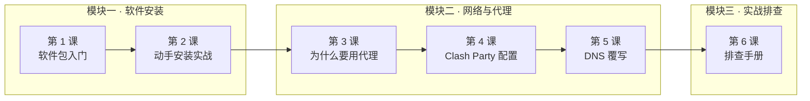

# 📚 今日课程：Linux 与网络入门

> 这是 2026-08-13 下午的课程合集。点击下方任意课程展开学习，或按顺序从头学起。

---

## 🗺️ 课程地图

今天的课分三个模块，从**装软件**到**网络原理**再到**实战排查**，一条线下来：

## 📖 课程列表

### 模块一 · 软件安装

| 课程 | 内容 | 用时 |
|------|------|------|
| [第 1 课 · Linux 软件包入门](01-package.md) | deb / rpm、x64 / arm64，怎么选对安装包 | 15 分钟 |
| [第 2 课 · 动手安装实战](02-install-practice.md) | 下载 → 验证 → 安装 → 确认的完整流程 | 20 分钟 |

### 模块二 · 网络与代理

| 课程 | 内容 | 用时 |
|------|------|------|
| [第 3 课 · 为什么要用代理](03-proxy-basics.md) | 代理原理、节点/订阅/客户端概念 | 15 分钟 |
| [第 4 课 · Clash Party 配置指南](04-clash-party.md) | 订阅导入 → 选节点 → 模式 → DNS | 20 分钟 |
| [第 5 课 · DNS 覆写是什么](05-dns-override.md) | DNS 污染/泄露、fake-ip、覆写原理 | 15 分钟 |

### 模块三 · 实战排查

| 课程 | 内容 | 用时 |
|------|------|------|
| [第 6 课 · 常见问题排查手册](06-troubleshooting.md) | 排查方法论 + 真实案例复盘 | 20 分钟 |

---

## 🎯 学习建议

- **零基础**：按 1 → 6 顺序学，每课末尾有课后作业
- **只想知道怎么配梯子**：直接看 [第 4 课](04-clash-party.md)，遇到问题再翻 [第 6 课](06-troubleshooting.md)
- **想搞懂原理**：重点看 [第 3 课](03-proxy-basics.md) 和 [第 5 课](05-dns-override.md)

---

*这个章节会随学习进度持续更新。未来的新课程会以新章节的形式加入。*
