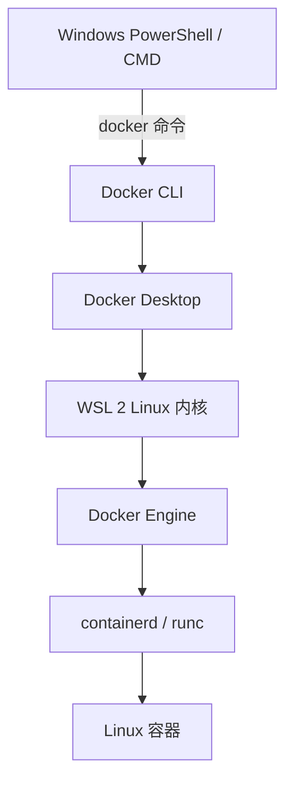

# 运行架构 · Windows、WSL 2 与 Linux

## Docker Desktop 在 Windows 上是什么

Docker Desktop 不是单纯的图形界面。对于 Linux 容器，它同时负责：

- 提供和管理 WSL 2 Linux 运行环境
- 运行 Docker Engine
- 安装 Docker CLI、Buildx 和 Compose
- 连接 Windows 与 Linux 的文件系统和网络
- 把 Windows 端口转发到容器
- 管理镜像、容器、Volume、日志和更新



## Linux 为什么通常只装 Docker Engine

Linux 宿主机本身已经有 Linux 内核，可以原生提供 namespace、cgroup、网络栈和文件系统能力：

```text
Linux → Docker CLI → Docker Engine → Linux 容器
```

Windows 内核不能直接运行普通 Linux 容器，所以需要 WSL 2 提供真正的 Linux 内核：

```text
Windows → Docker Desktop → WSL 2 → Docker Engine → Linux 容器
```

Linux 也有 Docker Desktop，但它是可选的开发者工具；服务器上通常直接运行 Docker Engine。

## CLI 和 Engine 是客户端/服务端关系

执行：

```powershell
docker ps
```

这里的 `docker` 是 CLI 客户端。它把请求发给 Docker Engine，Engine 再查询容器状态并返回结果。

```text
docker CLI  = 遥控器
Docker Engine = 真正干活的机器
Docker Desktop = Linux 运行环境 + Engine + Windows 集成 + 管理界面
```

因此 `docker version` 会同时显示：

- `Client`：当前终端使用的 Docker CLI
- `Server`：实际运行镜像和容器的 Docker Engine

如果只有 Client 而没有 Server，通常是 Docker Desktop、WSL 2 或 Engine 没有正常启动。

## 容器和虚拟机的区别

虚拟机通常包含完整的客户操作系统和独立内核；同一台 Docker 主机上的 Linux 容器共享宿主 Linux 内核，但拥有隔离的进程、网络和文件系统视图。

```text
WSL 2 Linux 内核
├─ nginx 容器：nginx 文件系统 + 独立进程空间
├─ Redis 容器：Redis 文件系统 + 独立进程空间
└─ Python 容器：Python 文件系统 + 独立进程空间
```

!!! warning "隔离不等于绝对安全"

    容器内的 `root` 不等于 Windows 管理员，但也不能把容器当成绝对安全边界。挂载 Docker Socket、使用 `--privileged` 或暴露敏感宿主目录，都可能让容器影响宿主环境。

## PowerShell 与 Ubuntu WSL 的关系

Docker Desktop 启动后，可以直接在 PowerShell 使用 Docker，不要求另外安装 Ubuntu：

```powershell
docker version
docker ps
```

如果以后安装 Ubuntu WSL，并在 Docker Desktop 中开启 `Settings → Resources → WSL Integration`，也可以在 Ubuntu 终端使用同一个 Docker Desktop Engine。

不要无意中同时维护 Docker Desktop Engine 和 Ubuntu WSL 内手动安装的另一套 Engine，否则容易出现“镜像和容器到底在哪一套 Engine 里”的混乱。

## Linux containers 与 Windows containers

日常使用的 nginx、Ubuntu、Redis、MySQL、Node、Python 镜像大多是 Linux 镜像，应保持 Docker Desktop 的 Linux containers 模式。

只有明确需要 Windows Server Core、IIS 或其他 Windows 原生容器镜像时，才考虑切换到 Windows containers。两种模式使用不同内核，配置和镜像集合也不同。
