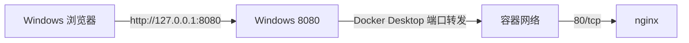

# 网络、端口与 nginx 实战

## `8080:80` 到底是什么意思

```powershell
docker run -d -p 8080:80 --name web-server nginx
```

格式是：

```text
-p 宿主机端口:容器端口
```

请求链路：



nginx 在容器内部监听 80，Windows 浏览器访问的是宿主机的 8080。

## 只允许本机访问

```powershell
-p 127.0.0.1:8080:80
```

这只绑定 Windows 回环地址，适合本地开发。

下面的写法通常绑定所有网络接口：

```powershell
-p 8080:80
```

`docker ps` 会显示：

```text
0.0.0.0:8080->80/tcp
```

它可能允许局域网设备通过 Windows 的局域网 IP 访问，是否真正可达还取决于 Windows 防火墙和网络策略。

## 当前 nginx-demo 实验

拉取镜像：

```powershell
docker pull 172.20.10.4:5000/nginx-demo:v1
```

启动：

```powershell
docker run -d `
  -p 127.0.0.1:8080:80 `
  --name web-server `
  172.20.10.4:5000/nginx-demo:v1
```

验证：

```powershell
docker ps
curl.exe -v http://127.0.0.1:8080/
```

浏览器打开：

```text
http://127.0.0.1:8080/
```

注意是 `http://`，不是 `https://`。

## 一次真实排错：web-server 为什么不存在

排查时执行：

```powershell
docker inspect web-server
```

返回：

```text
No such object: web-server
```

但进一步查看全部容器：

```powershell
docker ps -a
```

发现实际容器名是：

```text
web-derver
```

容器其实正常运行，端口也是：

```text
0.0.0.0:8080->80/tcp
```

直接请求返回 `HTTP/1.1 200 OK` 和 `Welcome to nginx!`。根因不是 Docker 网络故障，而是容器名拼写错误导致前面的诊断命令查错了对象。

可以改名：

```powershell
docker rename web-derver web-server
```

这个案例说明：**先用 `docker ps -a` 看真实状态和真实名称，再根据证据继续排查。**

## 容器之间怎样通信

同一个 Compose 网络或自定义 bridge 网络中，容器可以通过容器名或服务名通信：

```powershell
docker network create demo-net
docker run -d --name web --network demo-net nginx
docker run --rm --network demo-net busybox wget -q -O- http://web
```

这里的 `web` 由 Docker 内置 DNS 解析，不需要固定容器 IP。

记忆方法：

```text
-p          宿主机 ↔ 容器
--network   容器 ↔ 容器
```
