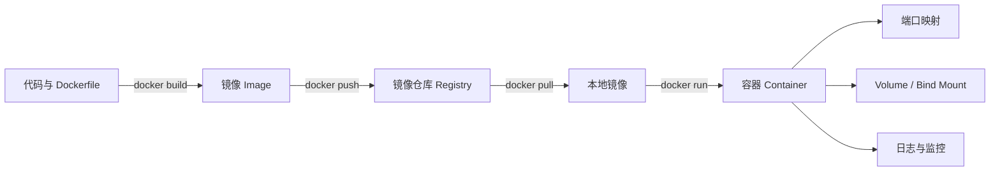

# Docker 学习路线与知识地图

> 这里是从每日学习日志中沉淀出来的主题知识库。日志保留“当天怎样学、踩了什么坑”，知识库负责回答“以后遇到问题去哪里查”。

!!! abstract "先记住这一条主线"

    **代码与 Dockerfile → 构建镜像 → 推送 Registry → 拉取镜像 → 创建容器 → 映射端口与挂载数据 → 观察和排错。**

## 知识地图

## 推荐阅读顺序

1. [运行架构 · Windows、WSL 2 与 Linux](01-architecture.md)：理解 Docker Desktop 为什么存在。
2. [镜像、容器与 Registry](02-image-container-registry.md)：理解 `pull`、`run`、`tag`、`push`。
3. [网络、端口与 nginx 实战](03-network-nginx.md)：看懂 `8080:80` 和浏览器请求链路。
4. [数据、构建与 Compose](04-storage-build-compose.md)：让数据持久化，把环境写成代码。
5. [排错手册](05-troubleshooting.md)：按证据定位问题，不靠反复重装。

## 两种阅读方式

| 目标 | 从哪里开始 |
|---|---|
| 系统学习 Docker | 按上面的知识库顺序阅读 |
| 回看真实学习过程 | 阅读 [2026-08-18](../log/2026-08-18.md)、[2026-08-19](../log/2026-08-19.md) 和 [2026-08-22](../log/2026-08-22.md) 日志 |
| 命令报错 | 直接打开 [排错手册](05-troubleshooting.md) |
| 部署一个网页 | 直接打开 [nginx 实战](03-network-nginx.md) |

## 当前实验环境

本知识库中的 Windows 实验基于：

- Windows 11
- Docker Desktop 4.87.0
- Docker Engine 29.7.2
- WSL 2.7.12
- Linux containers 模式
- 内网 HTTP Registry：`172.20.10.4:5000`

版本会变化，但核心模型不变：**Docker CLI 是客户端，Docker Engine 才是真正运行容器的服务端。**
