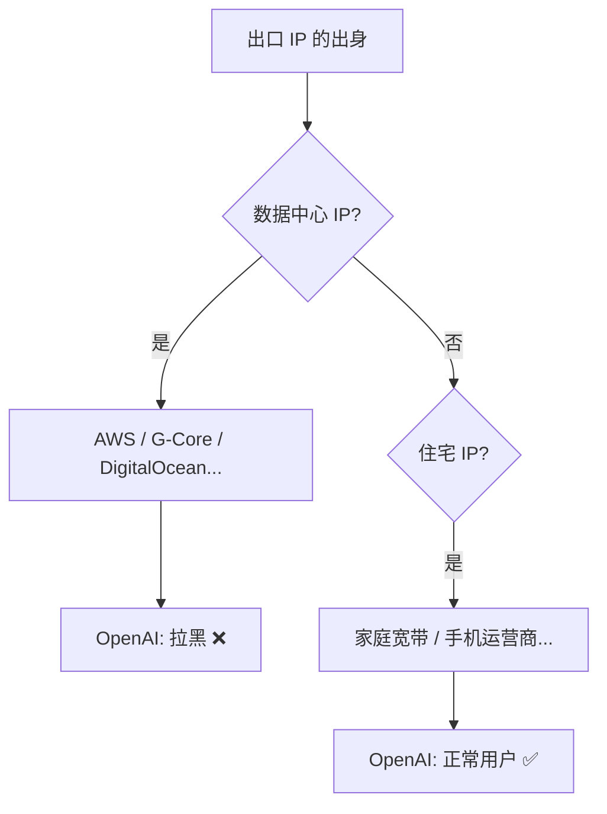
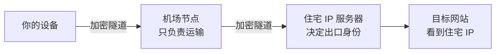
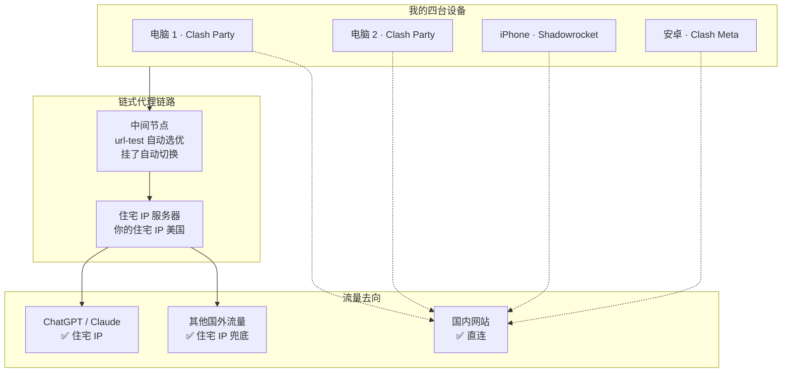
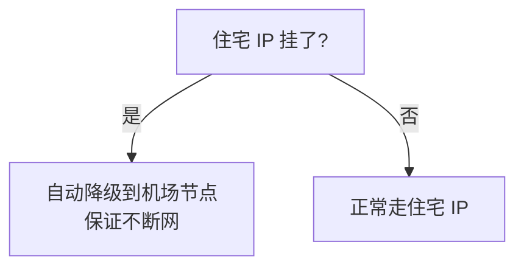

# 2026-08-14 · ChatGPT 解锁记：住宅 IP 链式代理

> 📅 **学习日志** · 2026 年 8 月 14 日

!!! abstract "一句话总结"

    从「两个机场全被 OpenAI 屏蔽」到「2 台电脑 + 2 台手机全部走住宅 IP」，
    用一整天时间解锁 ChatGPT / Claude 全生态，顺带学会了链式代理的完整玩法。

---

## 📌 今日学习清单

> 季度总结直接看这里，每一条都能展开成下面的正文。

| # | 今日收获 | 一句话 |
|---|---------|--------|
| 1 | 机场节点 ≠ 原生 IP | 数据中心 IP（AWS / G-Core）会被 OpenAI 拉黑 |
| 2 | 住宅 IP 才是正解 | 静态住宅 IP 看起来就是「普通用户」 |
| 3 | 国内网络有 DPI 干扰 | 直连住宅 IP 服务器，明文 SOCKS5 握手被丢弃 |
| 4 | 链式代理 | 机场节点（运输）→ 住宅 IP（出口），中间节点不可见 |
| 5 | Clash 覆写机制 | YAML 覆写替换数组，JS 覆写追加——加节点必须用 JS |
| 6 | dialer-proxy | mihomo 官方链式语法，指向 url-test 组自动容灾 |
| 7 | url-test 容灾 | 候选池只放「验证过能连住宅 IP 服务器」的节点 |
| 8 | 防环路 | 代理服务器自己的地址，永远不能走它自己 |
| 9 | Shadowrocket | conf 配置 + chain 参数 + 「配置」模式 |
| 10 | 验证方法论 | 延迟测试 + 内核日志 + IP 定位，数据说话 |

---

## 一、故事的开始：为什么机场节点连不上 ChatGPT

### 1.1 那天的起点

> 目标很小：**在 Linux 上用 ChatGPT 桌面版**。

第一盆冷水来得很快——`chatgpt.com` 返回 **403**。查出口 IP：AWS 数据中心。两个机场、几十个节点全部实测，清一色数据中心 IP，**全被 OpenAI 拉黑**。

### 1.2 关键认知：机场节点 ≠ 原生 IP



- **数据中心 IP**：云厂商的服务器 IP，机场节点出口基本都是这种，「一看就是服务器」
- **住宅 IP**：真实家庭宽带 / 手机运营商 IP，看起来就是普通用户

!!! warning "不只是 ChatGPT"

    Claude、Gemini 等 AI 服务对数据中心 IP 同样敏感。买机场跑 AI，先问「是不是原生 IP」。

### 1.3 实测数据（别信感觉，信数据）

| 测试 | 出口 | 结果 |
|------|------|------|
| 机场 US 节点 ×20 | AWS us-west-1 等 | 全部 403 ❌ |
| 机场新订阅节点 ×22 | G-Core Labs 等 | 全部 403 ❌ |
| 住宅 IP 直连 | 你的住宅 IP（美国） | 通过 ✅ |

---

## 二、方案：住宅 IP + 链式代理

### 2.1 意外：住宅 IP 直连也不行？

住宅 IP 到手后直接配置，发现**连不上**——TCP 能通（SYN 能到），但 SOCKS5 握手数据一发就超时。

!!! note "原因：DPI 干扰"

    国内网络（实测某运营商）对 **443 端口的非 TLS 明文流量**有深度包检测（DPI）干扰。
    SYN 握手放行，但带数据的连接被丢弃。

### 2.2 解法：加密隧道中转（链式代理）



- **机场节点**：只负责「运输」（绕开 DPI 干扰），不决定出口 IP
- **住宅 IP 服务器**：决定出口 IP（网站看到的是它）

!!! tip "关键认知：中间节点对风控无影响"

    OpenAI 只看得到最终出口（你的住宅 IP），**中间节点完全不可见**。
    所以中间节点选香港还是美国都一样安全——选延迟低的就行。

---

## 三、电脑端配置：Clash Party

### 3.1 覆写方式：JS 而不是 YAML

| 方式 | 行为 | 后果 |
|------|------|------|
| YAML 覆写 | `proxies:` **整体替换** | 56 个机场节点被换成 1 个 → 内核拒绝启动 |
| JS 覆写 | `config.proxies.push()` **追加** | 不动机场节点 ✅ |

!!! danger "血泪教训"

    第一次用 YAML 覆写，内核直接报 `US-节点1 not found` 拒绝启动。
    排查半天发现是覆写把节点全替换了。**加节点永远用 JS 覆写。**

### 3.2 完整脚本（可直接复用）

```js
function main(config) {
  // 1. 住宅 IP 节点（dialer-proxy = 链式中转，指向「连住宅IP」组）
  config.proxies.push({
    name: "住宅IP-美国芝加哥",
    type: "socks5",
    server: "203.0.113.10",
    port: 443,
    username: "你的用户名",
    password: "你的密码",
    "dialer-proxy": "连住宅IP"   // ⚠️ 连字符属性名必须加引号！
  });

  // 2. 「住宅IP」组：ChatGPT 等流量走这里
  config["proxy-groups"].push({
    name: "住宅IP",
    type: "select",
    proxies: ["住宅IP-美国芝加哥"]
  });

  // 3. 「连住宅IP」组：中间节点候选池，自动选延迟最低的
  config["proxy-groups"].push({
    name: "连住宅IP",
    type: "url-test",
    url: "http://www.gstatic.com/generate_204",
    interval: 300,
    proxies: ["US-节点1", "US-节点2", "HK-节点1", "HK-节点2"]  // 已验证能连住宅IP服务器的节点
  });

  // 4. 规则：AI 流量走住宅 IP
  config.rules.unshift(
    "IP-CIDR,203.0.113.10/32,连住宅IP",   // 防环路：住宅IP服务器本身走中间节点
    "DOMAIN-SUFFIX,openai.com,住宅IP",
    "DOMAIN-SUFFIX,chatgpt.com,住宅IP",
    "DOMAIN-SUFFIX,oaistatic.com,住宅IP",
    "DOMAIN-SUFFIX,oaiusercontent.com,住宅IP",
    "DOMAIN-SUFFIX,anthropic.com,住宅IP",
    "DOMAIN-SUFFIX,claude.ai,住宅IP"
  );

  // 5. 兜底：所有未匹配的国外流量全走住宅 IP
  config.rules = config.rules.map(r => r.startsWith("MATCH,") ? "MATCH,住宅IP" : r);

  return config;
}
```

### 3.3 三个关键概念

!!! info "① dialer-proxy：链式代理的核心"

    给住宅 IP 节点指定 `dialer-proxy`，意思是「**通过这个组建立连接**」：
    先经机场节点中转，再连住宅 IP 服务器。

    注意：mihomo 内核连节点服务器是「内核直连」，**不走规则**——
    光写 `IP-CIDR,203.0.113.10/32,主代理` 这种规则没用，必须用 `dialer-proxy`。

!!! info "② url-test 组：自动容灾"

    每 300 秒自动测速，选延迟最低的节点；当前节点挂了自动切换。
    前提：池子里只放「验证过能连住宅 IP 服务器」的节点——
    节点到 gstatic 快 ≠ 能连住宅 IP 服务器（实测台湾节点就翻车了）。

!!! info "③ 防环路"

    `IP-CIDR,203.0.113.10/32,连住宅IP`：住宅 IP 服务器自己的地址不能走
    「住宅IP」组（否则自己连自己死循环），要走「连住宅IP」运输通道。

### 3.4 验证方法

```bash
# 节点延迟（应返回 {"delay": 245} 而不是 Timeout）
curl --unix-socket /tmp/mihomo-party-*.sock \
  "http://localhost/proxies/住宅IP-美国芝加哥/delay?url=http://www.gstatic.com/generate_204&timeout=8000"

# 真实链路测试（走 TUN）
curl -s -o /dev/null -w "%{http_code}" https://example.com   # 200 = 走住宅IP成功

# 看内核日志确认走向
grep "住宅IP" ~/.config/mihomo-party/logs/core-*.log
# chatgpt.com:443 match DomainSuffix(chatgpt.com) using 住宅IP[住宅IP-美国芝加哥]
```

---

## 四、手机端配置

### 4.1 iPhone / Shadowrocket

用**配置文件**（conf）管理规则，比 UI 点选更可控：

```
[Proxy]
住宅IP-美国 = socks5, 203.0.113.10, 443, 用户名, 密码, chain = HK-节点1

[Proxy Group]
连住宅IP = url-test, HK-节点1, HK-节点2, US-节点1, url = http://www.gstatic.com/generate_204, interval = 300

[Rule]
IP-CIDR,203.0.113.10/32,连住宅IP,no-resolve
DOMAIN-SUFFIX,openai.com,住宅IP-美国
DOMAIN-SUFFIX,chatgpt.com,住宅IP-美国
DOMAIN-SUFFIX,anthropic.com,住宅IP-美国
DOMAIN-SUFFIX,claude.ai,住宅IP-美国
GEOIP,CN,DIRECT
FINAL,住宅IP-美国
```

!!! warning "Shadowrocket 两个坑"

    - `chain = 节点名` 是链式代理（也可 UI 里点节点 ⓘ → 「代理通过」）
    - **全局路由必须选「配置」**——「代理」模式会让所有分组和规则失效！
    - 手机端**手动固定中间节点**最可靠（自动测速会选到「测速快但连不上住宅 IP」的节点）

### 4.2 Android / Clash Meta

安卓和电脑同内核（mihomo），两种方式：

1. **JS 覆写**：和电脑一模一样的脚本
2. **完整配置导入**：把电脑的 `work/config.yaml` 传手机，CMFA 本地导入
   （机场大更新后重新导一次，或用 GitHub 私有仓库托管订阅）

---

## 五、踩坑记录（按时间顺序）

| # | 坑 | 表现 | 原因 | 解决 |
|---|-----|------|------|------|
| 1 | YAML 覆写替换节点 | 内核启动失败 | 覆写整体替换 proxies | 改用 JS 覆写 |
| 2 | 住宅 IP 直连超时 | SOCKS5 握手失败 | 国内 DPI 干扰明文流量 | 链式代理（加密中转） |
| 3 | 环路死循环 | 连住宅 IP 服务器超时 | 服务器地址走了自己 | IP-CIDR 规则指向运输组 |
| 4 | JS 语法错误 | `Unexpected token '-'` | `dialer-proxy` 连字符未加引号 | 写成 `"dialer-proxy"` |
| 5 | 自动选到坏节点 | 住宅 IP 节点超时 | 测速 URL 测的是 gstatic 不是住宅 IP | 池子只放验证过的节点 |
| 6 | Shadowrocket 显示真实 IP | IP 定位是本地 | 全局路由选了「代理」或「直连」 | 切「配置」模式 |

---

## 六、最终架构



!!! success "风控视角：什么是最安全的状态"

    所有 AI 流量统一从**同一个固定住宅 IP** 出去，行为像真实美国用户。
    **别做**：住宅 IP 和机场节点换来换去（IP 跳变才触发风控）。

---

## 七、总结

### 七个要点

1. **数据中心 IP 是 AI 服务的死穴**，住宅 IP 是正解
2. **国内直连住宅 IP 会被 DPI 干扰**，必须链式代理中转
3. **中间节点不影响风控**（目标网站看不到），选延迟低的
4. **JS 覆写追加节点**，url-test 组自动容灾，`dialer-proxy` 实现链式
5. **手机端手动固定中间节点**最省心，别迷信自动测速
6. **验证永远用数据说话**：延迟测试、日志、IP 定位，缺一不可

### 今日感悟

> 🌱 买机场 ≠ 能上 ChatGPT，节点显示「美国」≠ 原生 IP。
> 最贵的不是钱，是踩坑的时间——希望这篇能帮你把时间省下来。

---

## 八、目前的局限性

> 方案能跑，但要说清楚它「不完美」的地方，才能规划下一步。

### 8.1 单点依赖

- **住宅 IP 服务器是唯一出口**：它挂了，所有设备国外流量全断（目前没有自动降级到机场的机制）
- **机场账号是中间节点的来源**：机场跑路 / 节点大调整时，候选池需要重新验证更新

### 8.2 性能天花板

| 限制 | 说明 |
|------|------|
| 延迟 | 链式 3 跳（本机 → 机场 → 住宅IP → 目标），实测完整链路 250~320ms，比单跳高 |
| 带宽 | 受机场节点 + 住宅 IP 服务器双重限制，大流量下载 / 高清视频体验一般 |
| 稳定性 | 链路中任一跳波动都会影响整体 |

### 8.3 并发与成本

- **并发限制未知**：一个住宅 IP 账号同时被 4 台设备用，还没确认服务商的上限（可能被挤掉线）
- **持续成本**：住宅 IP 按月付费，是长期开销
- **单出口信誉**：所有设备共用一个 IP，某台设备行为异常（下载盗版、被网站标记）可能影响整体

### 8.4 维护工作

- **手机端手动维护**：iPhone 中间节点是手动固定的，挂了要手动换
- **规则覆盖有限**：显式规则只写了 OpenAI / Anthropic，新出的 AI 服务靠兜底（能用但没专门优化）
- **安卓配置是快照**：机场大更新后需要重新生成导入

---

## 九、未来的发展方向

### 9.1 容灾升级（最优先）



- 用 Clash 的 **fallback 组**实现「住宅 IP 优先、机场兜底」的自动降级
- 手机端开「启用回退」+ 精简节点池，实现全自动切换

### 9.2 多住宅 IP 池

- 再买 1-2 个不同地区的住宅 IP（如日本），用负载均衡 / 按需选择
- 好处：分流（美国 IP 走 OpenAI、日本 IP 走其他）、降低单点风险

### 9.3 家庭组网

- 把配置同步到**软路由**（OpenWrt + OpenClash），全家设备（电视、游戏机、智能家居）自动走住宅 IP
- 配合 **Tailscale** 组网，出门在外也能用家里的链路

### 9.4 订阅自动化（捡起没搞完的方案 C）

- sub-store 合成订阅：机场节点更新后自动重新合成，手机零维护
- 或 GitHub 托管 + 定时任务，云端配置自动刷新

### 9.5 扩展 AI 服务覆盖

- 显式规则扩展到 Gemini、Midjourney、Perplexity 等更多服务
- 建立「AI 服务域名清单」，新服务出现时快速接入

### 9.6 知识深化

- 深入学习 mihomo 内核、TUN / fake-ip / DNS 原理
- 尝试自建节点（VPS + 隧道），理解机场背后的原理
- 学习 IP 纯净度检测与风控规避的完整方法论

!!! tip "我的下一步计划"

    短期：确认住宅 IP 并发上限 → 做「住宅 IP 挂了自动降级机场」的容灾。
    中期：换软路由，让全家设备受益。
    长期：多地区住宅 IP 池 + 订阅自动化，彻底告别手动维护。
