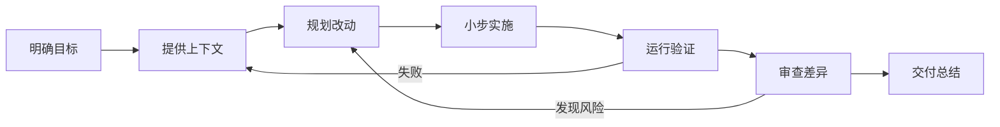

# 2026-08-15 · Codex CLI：从命令到工程闭环

> 📅 **学习日志** · 2026 年 8 月 15 日 · 自动化专业 / 工程实践

!!! abstract "一句话总结"

    Codex CLI 不只是“帮我写代码”的聊天窗口。真正高效的用法，是让它围绕明确目标读取工程、制定计划、小步修改、真实验证，再把结果交付清楚。

<a class="md-button md-button--primary" href="../../codex-cli/">打开 Codex CLI 交互式工作台 →</a>

---

## 📌 今日学习清单

| # | 今日收获 | 一句话 |
|---|---------|--------|
| 1 | 先确认工作环境 | 用 `/status` 看目录、模型、权限和上下文 |
| 2 | 区分两类命令 | `/命令` 控制 Codex，`!命令` 在终端执行 |
| 3 | 先给目标再给文件 | 目标、上下文、约束、完成标准缺一不可 |
| 4 | 复杂任务先规划 | 用 `/plan` 明确范围、风险和验证方案 |
| 5 | 修改必须有证据 | 测试、编译、仿真或日志要真实运行 |
| 6 | 交付前主动审查 | 用 `/diff` 和 `/review` 找遗漏与回归风险 |
| 7 | 长任务管理上下文 | 用 `/rename`、`/compact`、`/resume` 保持连续性 |
| 8 | 用 Skills 固化流程 | 将重复的专业工作交给稳定、可复用的工作流 |

---

## 一、我今天建立的 Codex CLI 心智模型



以前容易把任务说成：“帮我改一下这个程序。”问题在于，Codex 不知道我真正要解决什么、哪些地方不能动、怎样才算完成。

现在更可靠的表达是：

> **目标 Goal + 上下文 Context + 约束 Constraints + 完成标准 Done when**

例如：

```text
目标：给 PID 仿真程序增加阶跃输入参数。

上下文：入口在 src/simulation.py，现有测试在 tests/。

约束：不改变原有接口；时间用秒，角度用弧度；不新增依赖。

完成标准：新增边界测试，运行全部测试，并说明改动文件与剩余风险。
请先制定计划，再开始修改。
```

---

## 二、安全启动与权限

我目前更适合使用受控权限启动：

```bash
codex --sandbox workspace-write --ask-for-approval on-request
```

- `workspace-write`：允许 Codex 修改当前工作区，但不随意写系统其他位置
- `on-request`：需要网络访问、系统级操作或扩大权限时，再由我确认
- `/status`：进入项目后先检查实际工作目录、模型、权限和上下文
- `/permissions`：需要时重新查看或调整当前会话的权限策略

!!! warning "我的安全原则"

    不因为“省一步”就给无限权限。先让 Codex说明准备做什么，再对真正需要的操作授权。

---

## 三、五类常见工程任务

### 3.1 阅读陌生项目

```text
请先阅读当前项目，不修改任何文件。

输出项目结构、程序入口、数据流、运行命令、测试方法，
以及三个最值得注意的风险。请区分代码事实和你的推断。
```

适合课程设计、开源项目和学长留下的工程。第一轮只建立地图，不急着改代码。

### 3.2 修改或新增功能

1. `/plan`：列出改动范围、接口、风险和验证方案
2. 确认计划后再实施，避免顺手重构无关代码
3. 运行真实测试或仿真
4. `/diff` 查看修改，再用 `/review` 复查

### 3.3 排查故障

```text
这是预期现象、实际现象和完整报错。

请先列出按可能性排序的原因，并为每个原因设计验证实验。
不要立即重写全部代码；找到证据后再提出最小修复。
```

关键变化是：从“猜一个原因”改成“原因 → 实验 → 证据 → 最小修复”。

### 3.4 检查交付

- `/diff`：确认已暂存、未暂存和未跟踪文件
- `!测试命令`：真实执行测试、格式化、静态检查或编译
- `/review`：重点检查功能错误、边界条件、单位、异常处理和缺失测试
- 最终摘要：写清改了什么、证据是什么、还剩什么风险

### 3.5 延续长任务

- `/rename`：给会话起一个可识别的名字
- `/compact`：对话过长时压缩上下文
- `/fork` 或 `/side`：探索另一条路线，不污染主任务
- `/resume`：下次继续保存的会话

---

## 四、自动化专业学生怎样用 Codex

### 控制与仿真

- 检查 PID、状态空间模型和采样周期的单位
- 为参数边界、饱和、异常输入增加测试
- 运行 MATLAB、Python 或 C/C++ 仿真后解释实际曲线
- 比较修改前后的超调量、稳态误差和响应时间

### 单片机与嵌入式

- 先阅读芯片手册和工程配置，再修改寄存器或外设代码
- 让 Codex指出中断、并发、缓冲区和时序风险
- 要求给出可在硬件上执行的最小验证步骤
- 明确哪些结论来自代码，哪些必须上板测量

### 实验数据

- 用脚本清洗 CSV，再计算误差和统计量
- 让图表标明变量、单位、采样条件和异常点
- 保留原始数据，生成过程可重复
- 不把“图看起来合理”当作验证结论

---

## 五、我的四级学习路线

| 阶段 | 目标 | 实践任务 |
|------|------|----------|
| Level 1 · 安全上手 | 看清环境再行动 | 只读分析一个已有项目，找到入口和测试命令 |
| Level 2 · 工程闭环 | 修改必须带验证 | 完成一次小改动、边界测试和 `/review` |
| Level 3 · 固化规范 | 让规则自动加载 | 用 `/init` 建立 `AGENTS.md`，写入单位与验证要求 |
| Level 4 · 扩展自动化 | 复用成熟流程 | 用 Skills、MCP 或 `codex exec` 处理重复任务 |

---

## 六、今日感悟

> 🌱 AI 能不能用好，关键并不在算力多少，而在于任务是否清楚、上下文是否准确、结果是否经过验证。

作为学生，我不需要一开始就追求复杂的多代理系统。先把“小任务做完整”练熟：读懂、计划、修改、测试、复查。这个闭环稳定之后，Skills 和自动化才真正有价值。

---

## 七、下一步计划

- 用 Codex 完成一个自动化专业的小型真实任务
- 为自己的课程设计创建精简版 `AGENTS.md`
- 建立固定的“修改前计划 + 修改后验证”模板
- 把每天的新知识继续写入本站学习日志

<a class="md-button md-button--primary" href="../../codex-cli/">继续进入交互式工作台练习 →</a>
