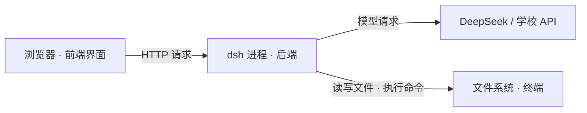

# 2026-08-18 · 工具链探索：DeepSeek Harness 与 Docker 入门

> 📅 **学习日志** · 2026 年 8 月 18 日 · 自动化专业 / 工具链实践

!!! abstract "一句话总结"

    一天双主题：上午以 DeepSeek Harness（dsh）为载体，走完 Linux 工具链、GitHub 用法、进程端口、故障排查、systemd、Obsidian、API 配置一整条链路；下午进入 Docker 世界，用"先懂原理再学命令"的方式装好引擎、跑通第一个容器、钻进 Ubuntu 容器亲眼验证了容器隔离原理。

---

## 📌 今日学习清单

| # | 今日收获 | 一句话 |
|---|---------|--------|
| 1 | 认识 agent harness | dsh 是"智能体框架"，一切皆插件，由 Cordis 驱动 |
| 2 | 手动安装全流程 | pnpm → git clone(镜像) → install → build → run，一步不落 |
| 3 | 前端/后端/进程 | 浏览器是前端，dsh 进程是后端，终端必须一直挂着 |
| 4 | 端口是什么 | EADDRINUSE = 端口被占；一个端口同时只能一个进程监听 |
| 5 | GitHub 五种获取方式 | clone / ZIP / gh / 包管理器 / raw 单文件，按目的选择 |
| 6 | 故障排查方法论 | 症状 → 查配置 → 看插件树 → 定位根因（版本不匹配） |
| 7 | systemd 服务管理 | 一条 `systemctl --user restart` 告别手动 kill |
| 8 | Obsidian 笔记库 | vault = 普通文件夹；Markdown 与网站工作流同源 |
| 9 | API 配置排查 | 学校网关要配自定义端点；凭据解析有优先级 |
| 10 | Docker 架构 | docker 命令（遥控器）→ dockerd（引擎）→ containerd（运行时） |
| 11 | 镜像/容器/仓库 | 镜像 = 只读模板；容器 = 运行实例；仓库 = 存镜像的地方 |
| 12 | 容器隔离原理 | 共享宿主内核，只带自己的文件系统和进程空间 |

---

# 第一部分 · DeepSeek Harness 探索

## 一、认识 agent harness（agent harness 是什么）

昨天还在用 Codex CLI，今天接触了另一个智能体框架：**DeepSeek Harness（dsh）** —— DeepSeek 官方开源，2026 年 8 月中旬刚发布，目前是开发者预览版。

它的核心设计就一句话：**一切皆插件**。模型适配器、工具注册表、会话日志、甚至 agent 主循环本身都是插件 —— 没有"特权核心"需要去改，想扩展就挂一个插件上去。

和 Hermes Agent（我现在用的）是同类东西：给 LLM 接上工具、记忆、执行环境，跑自主任务的框架。一个是 Nous 做的，一个是 DeepSeek 做的。



## 二、手动安装：第一次走完整工具链

今天全程手动安装，每一步都是概念课：

```text
装 pnpm（包管理器）→ git clone（拉源码，走 ghfast.top 镜像）
→ pnpm install（按 package.json 清单下载依赖到 node_modules）
→ pnpm run build（TypeScript 编译 + 前端打包）
→ pnpm dsh web（启动服务，监听 127.0.0.1:3080）
→ 浏览器打开网页端
```

几个关键理解：

- **pnpm 是"采购员"**：`install` 照着 `package.json`（购物清单）从 npm registry（全球零件仓库）下载到本地 `node_modules`（储物柜）
- **build 是"工厂组装"**：把人类写的 TypeScript 编译成机器能跑的 JS，把散装前端文件打包压缩
- **GitHub 直连超时**：网络环境问题，地址前加 `https://ghfast.top/` 或 `https://ghproxy.net/` 镜像前缀即可

## 三、GitHub 使用课：拿代码的五种姿势

| 方式 | 命令/操作 | 拿到什么 | 什么时候用 |
|------|-----------|----------|------------|
| 1. git clone | `git clone <地址>` | 整仓源码 + 全部历史 | 读源码 / 改代码 / 贡献 |
| 2. 网页下载 | Code → Download ZIP | 压缩包，无 git 历史 | 只要文件不要历史 |
| 3. gh 命令行 | `gh repo clone <仓库>` | 同 clone，不用记地址 | 已登录 gh，命令行派 |
| 4. 包管理器 | `pnpm add` / `dsh plugin add` | 打包好的成品 + 依赖 | 拿来"用"，不是拿源码 |
| 5. 单文件 | `curl <raw 地址>` | 一个文件 | 只要 README / 某个配置 |

**核心认知**：同一个东西有多种获取方式，选哪种取决于目的。装插件用方式 4（包管理器），研究源码用方式 1（clone）—— 去应用商店装 App，而不是去 GitHub 下源码自己编译。

## 四、插件广场探索

dsh 的插件广场叫 **dsh-market**（Settings → Plugin Market），目录里有 **1250+ 插件**，支持按 star 排序 —— 这就是"收藏量排行"。

学到的调查技巧：GitHub 话题（topic）搜索会有噪声（蹭标签的仓库混进来），要交叉验证。用社区精选列表（awesome-dsh-plugin）+ **GraphQL 批量查询**（一次查 100 个仓库的 star 数，13 次请求搞定 1269 个插件），才能排出真实榜单：

```text
收藏量前三（精选列表内）：
1. volcengine/OpenViking   28,953 ⭐   AI Agent 记忆层
2. vectorize-io/hindsight  20,124 ⭐   记忆工具
3. Q00/ouroboros            5,518 ⭐   Agent OS（自我进化）
```

## 五、一次完整的故障排查（版本不匹配）

装了 deep-whale 主题插件，重启后端也没效果。排查过程：

1. **症状**：重启没用，界面无变化
2. **查配置**：`cordis.patch.yml` 里 `disabled: true`，改成 false 还是没用
3. **看插件树**：`pnpm dsh --profile web --dump-config` 发现关键线索 —— `patch: entry "ui-skin-maid-atelier" not found`
4. **定位根因**：这个插件是给"更新版本"的 dsh 写的，它的接线入口（ui-skin-maid-atelier）在 rc.7 里根本不存在 —— **版本不匹配**，不是配置问题

> 📌 方法论：**症状 → 查证据 → 找真正的错 → 定位根因**。官方早警告过"会有破坏兼容性的变更"，预览版生态里插件追着最新框架跑，这是常态。

## 六、systemd：把服务交给进程管家

手动管理 dsh 进程很烦：终端一关服务就死、重启容易撞端口（EADDRINUSE）、还得手动 kill pid。

正解：注册成 **systemd 用户服务**（和 Hermes gateway 同款管理方式）：

```text
systemctl --user restart dsh-web    # 重启（自动杀旧起新）
systemctl --user stop dsh-web       # 停止
systemctl --user status dsh-web     # 看状态
journalctl --user -u dsh-web -f     # 看日志
```

从此告别手动 kill pid。配置文件在 `~/.config/systemd/user/dsh-web.service`，每个字段都理解：`ExecStart` = 启动命令、`Restart=on-failure` = 崩溃自动拉起。

## 七、Obsidian：建第一个笔记库

装 Obsidian（官方 .deb，走镜像下载 → `dpkg-deb -I` 验证 → `pkexec apt install`），建了第一个 vault：`nimo-notes`。

理解到位的地方：

- **vault = 一个普通文件夹**，所有笔记都是 .md 文件 —— 和 nimo-site 的 Markdown 工作流同源
- 命令速查表、首页双链（`[[命令速查表]]`）都已入库
- 踩了 GNOME 的"模板机制"坑：文件管理器右键默认没有"新建文档"，放一个文件到 `~/模板/` 就出现了
- 已配置 `OBSIDIAN_VAULT_PATH`，以后 Hermes 可以直接读写笔记库

## 八、API 配置排查：学校网关 + 凭据解析

在 dsh 里填了学校发的 API key 却报"无效"。排查结论：

- **学校 key 不是给官方端点用的**：需要配置自定义 provider（baseURL = 学校网关，协议 = OpenAI Completions，模型名 = 学校命名）
- **apiKeyEnv 是"凭据引用名"**，不是环境变量：dsh 解析优先级 = 启动环境变量 → `.credentials.yaml` → 各 .env 文件。UI 填的 key 存进凭据文件，立即生效
- **验证要实测**：`curl 网关/models -H "Authorization: Bearer ***"` 返回模型列表 = 全链路通

---

# 第二部分 · Docker 入门

## 一、Docker 是什么（架构）

装 Docker Engine 时拆开看过：`docker.io` 包里其实是三个东西：

    docker（CLI 客户端）  →  遥控器，你敲的命令
    dockerd（守护进程）    →  引擎，真正干活的，后台常驻
    containerd（运行时）   →  底层容器运行时

心智模型：**docker 命令把指令发给 dockerd 去执行** —— 和"浏览器前端 → dsh 后端进程"是同一种架构。装完用 `systemctl enable --now docker` 启动的正是 dockerd（上午学的 systemd 直接复用）。

## 二、三大核心概念

    镜像 Image     = 只读模板（蛋糕模具）—— 不是正在运行的软件
    容器 Container = 运行实例（模具做出来的蛋糕）—— 一次性
    仓库 Registry  = 存放镜像的地方（Docker Hub），用的时候才拉取

第一次实际接触：`docker run hello-world` 时引擎自动从 Docker Hub 拉镜像 → 创建容器 → 运行打印 → 退出。官方输出的 4 步正好印证这个链路。

## 三、进入 Ubuntu 容器（关键实验）

    docker run -it ubuntu bash

参数拆解：`-i` 保持标准输入打开（能打字进去），`-t` 分配伪终端（像正常终端），两个合起来 = "坐进容器操作"；`ubuntu` 是镜像名；`bash` 是启动后执行的命令。

进入容器后 6 个观察实验，每个都指向一个原理：

| 观察 | 结果 | 说明 |
|------|------|------|
| `ls` | 完整标准目录 | 镜像自带一整套 Ubuntu 文件系统 |
| `whoami` | root | 容器内默认 root，但权限被限制在容器内 |
| `ps aux` | 只有 2 个进程 | ⭐ PID namespace 隔离，看不到宿主机任何进程 |
| `cat /etc/os-release` | Ubuntu 26.04 | 镜像自带系统身份 |
| `apt update` | 成功 | 容器内可独立装软件，不污染宿主机 |

## 四、为什么 Ubuntu 里还能跑一个 Ubuntu

容器**没有装第二个系统**：它只借用宿主机唯一的 Linux 内核，自带一套文件系统（车身）+ 一个隔离的进程世界。

    宿主机：Linux 内核（唯一一份，大家共用）
      ├── 容器 A：镜像文件系统 + 独立进程空间
      └── 容器 B：另一个镜像文件系统 + 独立进程空间

类比：内核是引擎，文件系统是车身。虚拟机 = 引擎车身全套复制（重）；容器 = 共用引擎只换车身（轻、秒启动）。这也是"避免 ROS/Python 污染主系统"的根本原理 —— 装什么都在容器里，宿主干干净净。

## 五、踩坑记录（都是教材）

    permission denied ... docker.sock

`docker` 命令通过 `/var/run/docker.sock` 与引擎通信，这个 socket 属于 docker 组。加入 docker 组后**要重新登录才生效**（登录时才读取组列表）。临时方案：`newgrp docker` 切换当前终端身份。

---

# 今日总结

一天双主题，但底层是同一套方法论：

- **上午（dsh）**：没有学"一个新工具"，而是用 dsh 把底层概念串了起来 —— 包管理、构建、进程、端口、GitHub、插件生态、故障排查、服务管理、笔记体系、API 认证。最值钱的是排查方法论：遇到"装上了但没用"的问题，先看证据（配置、插件树、日志），再下结论，别靠猜。
- **下午（Docker）**：用"先懂原理再学命令"的方式完成第一课 —— 镜像/容器/仓库、遥控器与引擎、容器不是虚拟机。接下来按提纲继续：容器生命周期 → 数据（Bind Mount / Volume）→ 端口 → Dockerfile → Compose → 云服务器 → ROS / GPU。
