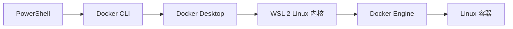

# 2026-08-22 · Windows Docker Desktop 全链路实战

> 📅 **学习日志** · 2026 年 8 月 22 日 · Windows / WSL 2 / Docker Desktop / 私有 Registry

!!! abstract "一句话总结"

    在 Windows 上完成 Docker Desktop 从“已安装但 Engine 起不来”到可用的全过程：安装并启用 WSL 2、配置 Docker Hub 镜像源、允许内网 HTTP Registry、从 Ubuntu Registry 拉取 nginx 镜像、映射 8080 端口运行，并用状态、日志、端口和 HTTP 响应完成一次证据驱动的排错。

---

## 📌 今日学习清单

| # | 今日收获 | 一句话 |
|---|---|---|
| 1 | Docker Desktop 的角色 | 不只是 GUI，而是 Windows 上的 Linux 容器运行环境和集成层 |
| 2 | Windows Docker 架构 | PowerShell → Docker CLI → Docker Desktop → WSL 2 → Docker Engine |
| 3 | WSL 2 前置条件 | Docker Desktop 进程存在，不代表 Engine 已经启动 |
| 4 | 镜像源配置 | `registry-mirrors` 主要用于 Docker Hub 拉取加速 |
| 5 | HTTP Registry | `insecure-registries` 是允许明文 HTTP，不是证书信任 |
| 6 | Registry 连通性 | `/v2/` 返回 200 `{}`，说明已连到 Registry API |
| 7 | 镜像拉取 | 成功拉取 `172.20.10.4:5000/nginx-demo:v1` |
| 8 | 端口映射 | Windows 8080 → 容器 nginx 80 |
| 9 | 排错证据链 | Desktop 状态 → 镜像 → 容器 → 日志 → 端口 → HTTP |
| 10 | 命名也会制造假故障 | `web-server` 实际写成 `web-derver`，导致按错误名字查询失败 |

---

# 第一部分 · Docker Desktop 已打开，为什么 Docker 还不能用

安装 Docker Desktop 后，托盘和后台进程都存在，但执行：

```powershell
docker version
```

只能看到 Client，Server 返回：

```text
Docker Desktop is unable to start
```

这说明：

```text
Docker CLI 已安装
≠ Docker Engine 已启动
```

继续读取 Docker Desktop 错误日志，找到真正原因：

```text
engine linux/wsl failed to start
checking WSL version
wsl is not installed
```

根因不是镜像源、不是 Docker 配置格式，而是 Linux 容器运行所需的 WSL 环境不存在。

!!! tip "今天最重要的排错动作"

    不根据“鲸鱼图标出现了”猜 Docker 正常，而是用 `docker version` 区分 Client 和 Server，再用日志定位 Engine 的启动前置条件。

# 第二部分 · 安装 WSL 2，让 Linux Engine 真正启动

安装 WSL 组件，并把默认版本设置为 2：

```powershell
wsl.exe --install --no-distribution
wsl.exe --set-default-version 2
```

这里使用 `--no-distribution`，因为 Docker Desktop 不要求额外安装一个 Ubuntu 用户发行版；它可以管理自己的 Linux 运行环境。

随后启动 Docker Desktop，再次验证：

```powershell
docker desktop status
docker version
```

结果同时出现 Client 和 Server：

```text
Docker Desktop 4.87.0
Docker Engine 29.7.2
Linux/amd64
```

至此链路变成：



# 第三部分 · 配置 Docker Hub 镜像源

在 Docker Desktop 的 `Settings → Docker Engine` 中保留原配置并加入：

```json
"registry-mirrors": [
  "https://docker.m.daocloud.io",
  "https://mirror.ccs.tencentyun.com",
  "https://docker.1ms.run"
]
```

没有一次塞入十几个来源，原因是失效镜像可能增加等待时间；同时删除了 HTTP 公共镜像，避免不必要的明文传输。

重启后验证实际生效值，而不是只看配置文件：

```powershell
docker info
```

Engine 返回了三个 Registry Mirrors，随后成功拉取并运行 `hello-world`：

```powershell
docker pull hello-world
docker run --rm hello-world
```

看到：

```text
Hello from Docker!
```

# 第四部分 · 允许内网 HTTP Registry

Ubuntu 机器上的 Registry 地址：

```text
172.20.10.4:5000
```

它使用 HTTP，而 Docker 默认按 HTTPS 访问，所以在 Docker Engine JSON 中加入：

```json
"insecure-registries": [
  "172.20.10.4:5000"
]
```

完整核心配置：

```json
{
  "builder": {
    "gc": {
      "defaultKeepStorage": "20GB",
      "enabled": true
    }
  },
  "experimental": false,
  "features": {
    "buildkit": true
  },
  "registry-mirrors": [
    "https://docker.m.daocloud.io",
    "https://mirror.ccs.tencentyun.com",
    "https://docker.1ms.run"
  ],
  "insecure-registries": [
    "172.20.10.4:5000"
  ]
}
```

验证 Docker 已按 HTTP 仓库识别：

```powershell
docker info
```

结果中该 Registry 显示：

```text
Secure: false
```

再直接检查 Registry V2 API：

```powershell
curl.exe http://172.20.10.4:5000/v2/
```

返回：

```text
HTTP 200
{}
```

!!! danger "insecure 的准确含义"

    这不是把仓库证书加入信任链，而是明确允许未加密的 HTTP。它适合可信实验内网，不适合跨互联网或正式生产环境。

# 第五部分 · 拉取并运行 nginx-demo

拉取：

```powershell
docker pull 172.20.10.4:5000/nginx-demo:v1
```

镜像全名拆解：

```text
172.20.10.4:5000   Registry 地址
nginx-demo         镜像仓库名
v1                 版本标签
```

运行：

```powershell
docker run -d `
  -p 8080:80 `
  --name web-server `
  172.20.10.4:5000/nginx-demo:v1
```

请求路径：

```text
Windows 浏览器
→ http://127.0.0.1:8080
→ Windows 8080
→ Docker Desktop 端口转发
→ 容器 80
→ nginx
```

# 第六部分 · “网页打不开”的真实排查

最初按预期名称检查：

```powershell
docker inspect web-server
```

返回：

```text
No such object: web-server
```

这看起来像容器根本没启动。但不能停在这一步，继续查看所有容器：

```powershell
docker ps -a
```

发现真正运行的是：

```text
NAME         IMAGE                                      STATUS
web-derver   172.20.10.4:5000/nginx-demo:v1             Up
```

原来只是把 `server` 写成了 `derver`。

继续验证状态、日志和端口：

```powershell
docker inspect web-derver
docker logs web-derver
docker port web-derver
curl.exe -v http://127.0.0.1:8080/
```

证据：

- 容器状态 `running`
- nginx 日志显示配置完成并启动 worker
- 端口为 `0.0.0.0:8080->80/tcp`
- curl 成功建立到 `127.0.0.1:8080` 的连接
- nginx 返回 `HTTP/1.1 200 OK`
- 页面内容是 `Welcome to nginx!`

所以 Docker、端口转发和 nginx 都正常。若浏览器仍失败，应检查浏览器是否自动使用了：

```text
https://127.0.0.1:8080/
```

正确地址是：

```text
http://127.0.0.1:8080/
```

容器名称可修正：

```powershell
docker rename web-derver web-server
```

# 第七部分 · Docker Desktop 到底相当于什么

今天最后补上的核心认知：

```text
Linux：
Linux 内核 → Docker Engine → 容器

Windows：
Windows → Docker Desktop → WSL 2 Linux 内核 → Docker Engine → Linux 容器
```

Docker Desktop 不只是一个“桌面版 docker”，它把 Windows 上缺失的 Linux 运行环境、Engine、网络、文件共享、Compose 和 GUI 管理都组合在了一起。

PowerShell 里的 `docker` 只是客户端；真正的 nginx 进程运行在 WSL 2 Linux 内核之上的容器中。

---

# 今日最终验证结果

```text
Docker Desktop       running
WSL 默认版本          2
Docker Engine        正常响应
Registry Mirrors     3 个 HTTPS 镜像源
HTTP Registry        172.20.10.4:5000，连通且已允许
nginx-demo:v1        拉取成功
nginx 容器            running
Windows 8080         已映射到容器 80
HTTP 请求             200 OK
```

# 今日方法论

今天最重要的不是记住更多命令，而是形成分层排查顺序：

```text
Docker Desktop / WSL
        ↓
Docker Engine
        ↓
Registry 与镜像
        ↓
容器状态与日志
        ↓
端口监听
        ↓
HTTP 响应与浏览器
```

每一层都先拿证据，再进入下一层。这样“网页打不开”不会被笼统地归结为 Docker 坏了。
