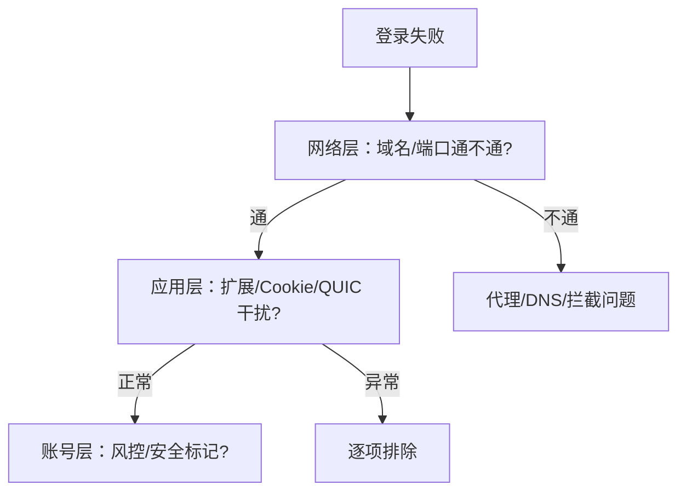
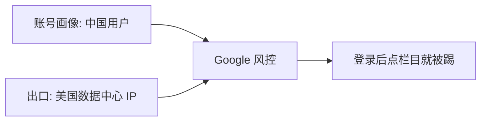

# 2026-09-10 · Chrome 无法登录 Google 账号排查记

> 📅 **学习日志** · 2026 年 9 月 10 日

!!! abstract "一句话总结"

    一个「Chrome 登录不了 Google 账号」的问题，背后藏着**四个互相独立的根因**——企业 VPN 的 HTTPS 拦截、损坏的 Cookie、干扰登录的浏览器扩展、被 Google 风控的数据中心 IP。用「分层排查 + 数据说话」逐个击破；实测证明登录后切回数据中心节点仍会被踢，最终把路由细化成「Google/AI 走住宅、其余走便宜节点」，并把方案落地到 iOS/Android 多台设备，顺带搞懂了策略组。

---

## 📌 今日学习清单

> 季度总结直接看这里，每一条都能展开成下面的正文。

| # | 今日收获 | 一句话 |
|---|---------|--------|
| 1 | 登录报错要分场景 | 网页版登录 ≠ Chrome 同步登录，是两条完全不同的链路 |
| 2 | 无痕模式是定位神器 | 无痕能登录 = 账号和网络都没问题，问题在扩展/配置 |
| 3 | 企业安全软件会 HTTPS 拦截 | 装了根证书做中间人 → 登录报 "Request canceled" |
| 4 | 400 malformed = Cookie 坏了 | 清 Cookie 即可，跟网络无关 |
| 5 | 数据中心 IP 会被 Google 风控 | 登录后点栏目被踢出 = 出口 IP 被标记 |
| 6 | 住宅 IP 更受信任 | Google 流量应走住宅 IP，而非数据中心节点 |
| 7 | 多设备要统一出口 | 所有设备 Google 走同一个住宅 IP，账号行为才一致 |
| 8 | 分层排查方法论 | 网络层 → 应用层 → 账号层，逐层排除 |
| 9 | 登录后切数据中心仍被踢 | 住宅 IP 是刚需，不是可选 |
| 10 | 路由要细化 | 住宅 IP 只背 Google/AI，其余走便宜节点 |
| 11 | 策略组是"选择器" | select=手动总闸，url-test=自动挑最快 |
| 12 | 主代理是总开关 | 普通流量兜底走「主代理 → 自动选择」 |
| 13 | ping0.cc 显示普通 IP 是正常的 | 它走普通节点，不代表住宅 IP 没生效 |
| 14 | 多设备维护清单 | 会变的只有机场节点名，其余固定 |

---

## 一、问题现象

一个账号登录，前后冒出**四种不同报错**，每种指向不同的根因：

| 阶段 | 报错 | 真正原因 |
|------|------|---------|
| ① 一开始 | `Request canceled` | 深信服 VPN 拦截 HTTPS |
| ② 卸载深信服后 | `400. That's an error (malformed)` | Cookie 损坏 |
| ③ 清 Cookie 后 | `Request canceled`（同步登录） | 浏览器扩展干扰 |
| ④ 网页能登录后 | 点栏目被踢回未登录 | 数据中心 IP 被风控 |

核心认知：**报错文字相同，不代表原因相同**。同一个 "Request canceled"，第一次是安全软件拦截，第二次是扩展干扰。

---

## 二、排查方法论：分层定位



三条经验（本期最有价值的部分）：

1. **无痕模式对比法**：无痕能登录 → 账号和网络 100% 没问题，问题锁定在「扩展 / Cookie / 浏览器配置」。
2. **网页版 vs 同步登录是两条链路**：头像菜单里的「登录 Chrome」走的是 Chrome 同步专用 OAuth 流程，比网页版 `accounts.google.com` 更脆弱。
3. **数据说话**：用 `https://xxx.google.com/generate_204` 逐域名测连通，用内核日志 `core-*.log` 看流量真实走向，用 IP 定位看出口 IP 性质——不靠猜。

---

## 三、四个真凶，层层剥开

### 真凶一：深信服 EasyConnect 的 HTTPS 拦截

**发现过程**：系统「受信任的根证书」里有一枚 `Sangfor Technologies Inc.` 证书，进程列表里有 `ECAgent.exe`、`SangforPWEx`、`SangforSP` 等服务。

**原理**：深信服 SSL VPN 为了「检查加密流量」，往系统塞根证书做 HTTPS 中间人拦截。即使 VPN 显示断开，它的防护服务仍在后台运行，把 Chrome 发给 Google 的登录请求掐断 → "Request canceled"。

**清理步骤**（私人电脑可彻底卸载）：

1. 停服务：`SangforPWEx`、`SangforSP`
2. 结束进程：`ECAgent`、`SangforUDProtectEx`
3. 删根证书（certmgr.msc → 受信任的根证书颁发机构）
4. 删驱动：`SangforVnic.sys`、`sc delete SangforVnic`
5. 删残留目录与 `SangforNspX64.dll`（Winsock 注入）

### 真凶二：损坏的 Cookie

表现是 `400. That's an error ... malformed`。这是 **Google 服务器拒绝**——收到的 Cookie 头异常。清 Cookie（`Ctrl+Shift+Del` 或删 `Network\Cookies` 文件）即解。

### 真凶三：浏览器扩展干扰

无痕能登录、正常窗口报错 → 差异在扩展。定位到两个第三方扩展：**AutoGLM**（AI 浏览器自动化，向页面注入脚本）、**迅雷下载支持**。禁用后同步登录即可走通。

注意：登录 Chrome 同步后，同步会自动恢复账号里存的扩展——要永久删除必须在 `chrome://extensions` 点「移除」，光删文件夹会被同步重新下载。

### 真凶四：数据中心 IP 被 Google 风控

最隐蔽的一个：**登录能成功，但一点「个人信息」等栏目就被踢回未登录**。

**根因**：Google 流量固定走 `US-3TCP`（VLESS+Reality 数据中心节点），而不是住宅 IP。Google 认为「数据中心 IP + 频繁登录」可疑，于是在你访问敏感页面时**主动吊销会话**。



**解法**：把 Google 规则从 `US-3TCP` 改指向住宅 IP。修改 mihomo 规则三行：

```yaml
# 改前
- DOMAIN-KEYWORD,googleapis,Google
- RULE-SET,Google-Site,Google
- RULE-SET,Google-IP,Google
# 改后（指向住宅 IP 组）
- DOMAIN-KEYWORD,googleapis,住宅IP
- RULE-SET,Google-Site,住宅IP
- RULE-SET,Google-IP,住宅IP
```

验证：内核日志从 `using Google[US-3TCP]` 变为 `using 住宅IP[住宅IP-美国芝加哥]`，之后登录稳定、不再被踢。

---

## 四、多设备统一出口

> 改了本机，还有一个更重要的后半场：账号同时登在 Windows ×2、Ubuntu、iOS、Android 上，出口 IP 不一致会怎样？

### 4.1 先纠正一个误区

Google 不会因为「几台设备用不同的美国 IP」就封号（封号只针对严重违规）。它真正做的是：

- **数据中心 IP** → 触发风控（就是本机遇到的"被踢"）
- **多 IP 短时间访问同一账号** → 提示"是不是你本人"

所以风险不是封号，而是**其他设备也被踢 + 频繁安全验证**。

### 4.2 需要统一什么

**核心一条：让所有设备的 Google 流量都走同一个住宅 IP**（而非"配置文件逐字节一致"）。

理由：

1. 数据中心 IP 是风控根源，其他设备还在走数据中心节点就会重演"被踢"
2. 统一到一个固定住宅 IP，账号行为最像"一个真实美国用户"
3. 本机配置本来就是"所有国外流量走住宅 IP"（`MATCH,住宅IP`），其他设备照做即天然一致

### 4.3 各设备怎么同步

| 设备 | 客户端 | 做法 |
|------|--------|------|
| 本机 Windows | Clash Party | ✅ 已完成（JS 覆写） |
| iOS | Shadowrocket | ✅ 已完成（conf + `chain` 链式，FINAL→PROXY） |
| Android | Clash Meta | ✅ 已完成（完整 yaml，内置住宅 IP + 规则） |
| 另一台 Windows | Clash Party | 复用桌面 JS 覆写脚本 |
| Ubuntu | Clash Party | 复用桌面 JS 覆写脚本 |

**三要素**（每台设备都要有）：

1. 住宅 IP 节点（socks5，`dialer-proxy` / `chain` 指向中间节点组）
2. 中间节点候选池（`连住宅IP` url-test 组）
3. 规则：Google 域名 → 住宅 IP 组

### 4.4 两个提醒

- **并发上限**：多设备共用一个住宅 IP，注意服务商并发限制；Google 流量轻量一般没问题，但别几台设备同时狂刷
- **别混着用**：同一账号避免"某台住宅、某台数据中心"来回切换——这种混合状态最容易触发风控

### 4.5 维护清单：什么会变、什么不变

| 项目 | 会不会变 |
|------|---------|
| 住宅 IP 地址 | 基本不变 |
| 规则逻辑（Google/AI → 住宅，其余 → 主代理） | 不变 |
| 整体架构（住宅 + 中转 + 规则） | 不变 |
| **机场节点名**（HK-3 这些） | **会变**（机场改名/删节点时） |

未来真正要维护的几乎只有一件事：**机场改了节点名，`连住宅IP` 组里那 12 个中转节点名要同步改**。关键信息就三样：住宅 IP 节点、12 个中转节点名、核心规则——记住这三样，机场一有变动照着改即可。

---

## 五、路由细化：住宅 IP 只背该背的流量

### 5.1 一个被实测推翻的假设

> 「登录态已经建立，切回普通美国节点应该就不触发风控了吧？」

实测：登录成功后，把 Google 从住宅 IP 切回数据中心节点 `US-3TCP`，一点「个人信息」立刻报 **400 malformed** 被踢。

**结论：住宅 IP 是刚需，不是可选**——这个账号对 IP 极其敏感，数据中心 IP 一律触发风控，跟登录态无关。

### 5.2 最终路由表

| 流量 | 出口 | 原因 |
|------|------|------|
| Google | 住宅 IP | 会风控，必须住宅 |
| ChatGPT / Claude | 住宅 IP | 会风控，必须住宅 |
| GitHub | HK 自动选择 | 不需要住宅，走 HK 快节点 |
| 其余国外流量 | 主代理（便宜节点） | 不需要住宅，走数据中心 |

关键认知：**住宅 IP 只背「会风控的服务」，其余流量走便宜节点**——既省资源又提速（GitHub 实测从 441ms 降到 129ms）。

### 5.3 规则收进覆写 JS

所有住宅相关规则统一放进 Clash Party 的 **JS 覆写**（`override/xxx.js`），而不是改基础订阅：

1. 订阅更新不会冲掉你的规则
2. 覆写 JS 就是"路由中心"，可原样复制到其他 Clash Party 设备

成本认知：住宅 IP 按月付费 = 固定成本；普通机场（追云加速等）只有数据中心节点，帮不了 Google 风控。

---

## 六、策略组入门：主代理、自动选择、住宅 IP

> 排错时反复看到「主代理」「自动选择」「住宅IP」这些词，把它们的关系彻底理清。

### 6.1 策略组是"选择器"

流量最终要通过某个**节点**出去。策略组（proxy group）就是一个"选择器"：里面装一堆节点（或别的组），由它决定"这批流量走哪个节点"。

### 6.2 两类最常见的组

| 类型 | 行为 | 例子 |
|------|------|------|
| **select**（手动） | 你手动选它用谁 | 主代理、住宅IP |
| **url-test**（自动） | 自动测速，选延迟最低的 | 自动选择、HK自动选择、连住宅IP |

### 6.3 主代理是总开关，自动选择是自动挑最快

- **主代理**（select）：普通流量的"总闸"。`MATCH → 主代理`，没被规则特别指定的流量都归它。
- **自动选择**（url-test）：主代理的默认选项，从所有节点里自动挑延迟最低的。

```
普通流量 → MATCH → 主代理 → 自动选择 → 最快节点
```

所以 ping0.cc 这种普通网站，会显示"自动选择组挑的那个节点"——这是正常的，**不代表住宅 IP 没生效**。

### 6.4 我们的两个定制组

| 组 | 类型 | 作用 |
|----|------|------|
| 住宅IP | select | 出口固定住宅 IP，给 Google/AI |
| 连住宅IP | url-test | 住宅链路的中转跳板，自动挑最快的中间节点 |

Google/AI 走住宅（规则指定），其余走「主代理 → 自动选择」，各司其职。

---

## 七、踩坑记录

| # | 坑 | 表现 | 教训 |
|---|----|------|------|
| 1 | 深信服后台驻留 | VPN 断开仍拦截 | 服务进程没退干净，别只看 VPN 连接状态 |
| 2 | 重装 Chrome 不清配置 | 旧 Cookie/扩展还在 | 卸载 Chrome 不会删 `User Data`，需手动备份清理 |
| 3 | 静默卸载参数 `/S` 不生效 | 退出码 1，文件残留 | 多组件套件要逐个 uninstall.exe 处理 |
| 4 | TUN 劫持 DNS | 域名解析成 198.18.x.x | 查真实 IP 要用公共 DNS 或 DoH 绕过 |
| 5 | 同报错不同因 | Request canceled 出现两次 | 别被报错文字迷惑，要分层定位 |
| 6 | JS 覆写和 Rewrite 混淆 | CFA 把 .js 当 YAML 报错 | CFA 的「覆写」易和 Rewrite/MITM 混淆，安卓直接导完整 yaml 更省心 |
| 7 | 安卓多加 GitHub→HK 规则 | GitHub 打不开 | 安卓 `MATCH` 已是主代理，GitHub 本就走普通节点，不必专门指 HK |
| 8 | Shadowrocket 首页选住宅 IP | 所有流量走住宅 | `FINAL→PROXY` 跟随首页全局节点，选普通节点才能只让 Google/AI 走住宅 |

---

## 八、总结

### 十个要点

1. 登录失败先分「网页版」还是「同步」——两条链路，诊断路径不同
2. **无痕模式是最快的二分法**：能登录就排除账号和网络
3. 企业安全软件（深信服等）的 HTTPS 拦截是登录问题的高频元凶，查根证书
4. `400 malformed` = Cookie 坏，`Request canceled` 要分场景深挖
5. **数据中心 IP 会被 Google 风控，住宅 IP 才是稳的出口**
6. 删扩展要在 `chrome://extensions` 操作，否则同步会恢复
7. **多设备要统一出口到同一个住宅 IP**，账号行为才一致
8. **住宅 IP 只背会风控的服务**（Google/AI），其余走便宜节点，省成本又提速
9. **策略组是选择器**：select=手动总闸，url-test=自动挑最快，看懂主代理和自动选择就懂了分流
10. **多设备维护清单**：会变的只有机场节点名，把「住宅 IP + 12 中转节点 + 规则」记牢即可

### 今日感悟

> 🌱 一个登录问题拆出了四个独立根因，最深的体会是：**报错只是现象，不是结论**。同一句 "Request canceled"，可能来自安全软件、扩展、Cookie、IP 风控四个完全不同的源头——不层层排除，就容易在错误的方向上反复试错。而排错之后的"多设备统一"，才是把单次修复沉淀成长期稳定的关键。
