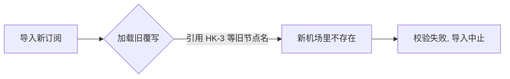
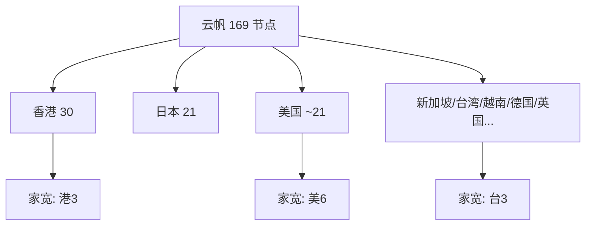
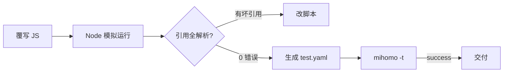
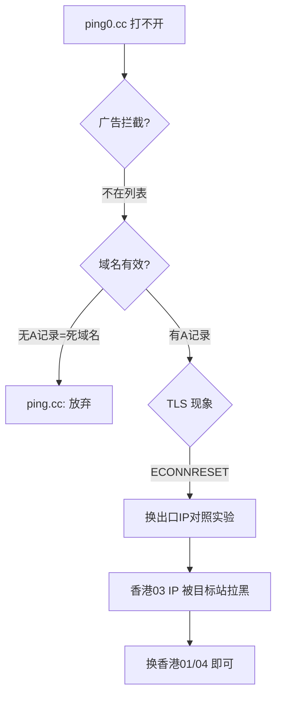

# 2026-09-14 · Clash Party 规则工程：换机场 + 全量分流

> 📅 **学习日志** · 2026 年 9 月 14 日

!!! abstract "一句话总结"

    旧机场的覆写残留导致新订阅导入失败（`'HK-3' not found`），借机把整套分流推翻重做：从零手写 JS 覆写，用 **29 个 mrs 规则集**把流量分成 AI / 学术 / 开发 / 流媒体 / 通讯 / 广告六类；在**导入前先用真实 mihomo 内核做校验**；再把「云帆」和「节点选择」两个重叠的总开关合并成一个（带传递闭包护栏）；最后用**临时内核实例 + API 切节点**的对照实验，定位出 `ping0.cc` 打不开是**目标站拉黑了出口 IP 段**，而非自己的规则问题。

---

## 📌 今日学习清单

> 季度总结直接看这里，每一条都能展开成下面的正文。

| # | 今日收获 | 一句话 |
|---|---------|--------|
| 1 | 导入失败先看引用 | 报错 `proxy group[x]: 'X' not found` = 规则引用了不存在的节点/组 |
| 2 | 覆写会"继承"旧机场 | 换机场后旧覆写里的节点名（HK-3 等）必然失配 |
| 3 | 新机场结构 | 云帆 = VLESS+Reality / Hysteria2，`[2x]/[3x]/[4x]` 是流量倍率 |
| 4 | 家宽节点 | 美国04 / 香港 / 台湾「家宽」= 住宅 IP，`[4x]` 贵 4 倍 |
| 5 | 动态匹配 | 用 `name.includes("家宽")` 而非写死，机场改名也不失效 |
| 6 | 幂等覆写 | 脚本先删自己上次生成的组/规则，可反复应用 |
| 7 | 规则集思维 | 别手写几百条，用 `rule-providers`（mrs）分类引用 |
| 8 | 值得借鉴的开源 | blackmatrix7 / ACL4SSR / Loyalsoldier / HosheaPDNX |
| 9 | AI 登录依赖域 | 光写 openai 不够，还要 auth0 / arkoselabs / statsig / intercom |
| 10 | 内核级验证 | `mihomo -t -f config.yaml` 导入前就查引用，`bad refs: 0` 才交付 |
| 11 | 总开关只能有一个 | 两个全节点 select 组并存 = 反直觉、易误判"全局生效" |
| 12 | 护栏式删组 | 重定向引用后，用"传递闭包"确认无人引用才删组 |
| 13 | 外区 Apple | 美区 ID 的 App Store/iTunes/Apple ID/iCloud → 走美国家宽 |
| 14 | fake-ip 实证 | `ping.cc` 解析成 `198.18.0.59`，是 fake-ip 的活证据 |
| 15 | DNS NODATA | 域名返回 SOA 却无 A 记录 = 死域名，谁都打不开 |
| 16 | 出口 IP 会被目标站拉黑 | `ping0.cc` 对香港02/03 的 IP 段直接 RST |
| 17 | 对照实验法 | 换出口 IP 再试，就能区分"我的问题"还是"目标站的问题" |

---

## 一、起因：新机场导入失败

导入新机场订阅（云帆）时报：

```
配置检查失败: msg="proxy group[3]: 连住宅IP: 'HK-3' not found"
```

**根因**：报错来自 08-14 写的旧覆写脚本，里面**写死了旧机场的节点名**（`HK-3`、`JP-2`、`US-3TCP`…）和组名（`HK自动选择`、`主代理`）。新机场没有这些名字 → 校验直接失败。



**临时解法**：在 Clash Party 里关掉覆写 → 导入成功。

**真正解法**：重写覆写，让它**按名称动态匹配**，不再依赖任何写死的节点名。

### 1.1 两个覆写项的本质

| 覆写项 | 类型 | 说明 |
|--------|------|------|
| `住宅ip_Chicago` | 本地 JS | 旧方案：手写节点名 + 芝加哥 socks5 链式 |
| `1a09e7acb6b` | 远程 YAML | 其实是"云帆订阅本身"被误加为覆写，冗余，可删 |

---

## 二、认识新机场：云帆的节点结构

新机场共 **169 个节点 + 3 个订阅自带组**（`云帆` / `自动选择` / `故障转移`）。

### 2.1 协议与倍率

- **VLESS + Reality**：伪装成正常 HTTPS（`servername` 用 cathaypacific / pccw / hsbc 等真实大站）
- **Hysteria2（Hy）**：UDP，弱网/跨地区速度好
- **`[2x] / [3x] / [4x]`**：**流量倍率**。`[4x]` 用 1G 扣 4G，家宽节点基本都是 `[4x]`

### 2.2 家宽（住宅）节点盘点

| 地区 | 数量 | 命名 |
|------|------|------|
| 美国 | 6 | `[4x]🇺🇸美国04丨家宽`（VLESS）+ `美国04-Hy丨家宽` |
| 香港 | 3 | `[4x]🇭🇰香港家宽-Hy` |
| 台湾 | 3 | `[4x]🇨🇳台湾家宽-Hy | AI解锁` |

> **没有日本家宽**。日本那 21 个都是中转/机房线路，不带住宅属性。



---

## 三、手写 JS 覆写：设计分层

新覆写的核心思想：**只按"特征"找节点，不写死名字**。

```js
const names = config.proxies.map(p => p.name);
const usHome  = names.filter(n => n.includes("家宽") && n.includes("美"));
const hkFast  = names.filter(n => n.includes("香港") && !n.includes("家宽"));
const jpFast  = names.filter(n => n.includes("日本") && !n.includes("家宽"));
```

三条工程原则：

1. **动态匹配**：机场改名/增删节点，脚本不用动。
2. **幂等**：每次先移除脚本上次生成的组和规则，再重新生成 → 反复应用不重复。
3. **兜底不空**：某个筛选结果为空时退回全部节点，保证配置永远合法。

### 3.1 生成的 10 个分组

| 分组 | 类型 | 用途 |
|------|------|------|
| 🚀 节点选择 | select | **总开关**（兜底，唯一） |
| ♻️ 自动选择 | url-test | 全节点自动测速 |
| 🇺🇸美国家宽 / -自动 | select / url-test | AI、Google、美区 Apple |
| 🇭🇰香港快速 | url-test | GitHub / 开发 |
| 🇯🇵日本快速 | url-test | 学术备选 |
| 🎓 学术 | select | 文献站点 |
| 📺 流媒体 | select | Netflix / YouTube / Disney+ |
| 💬 即时通讯 | select | Telegram / Discord / WhatsApp |
| 🛑 广告拦截 | select | 默认 REJECT，可切 DIRECT |

---

## 四、规则集工程：向开源借规则

调研了主流规则项目，结论：**别手写几百条域名，用分类规则集。**

| 项目 | 定位 |
|------|------|
| **blackmatrix7 / ios_rule_script** | 分类最全的域名规则集 |
| **ACL4SSR** | 完整配置模板 + 分组结构参考 |
| **Loyalsoldier / clash-rules** | 白名单/黑名单两种分流范式 |
| **HosheaPDNX / rule-set** | 把上面转成 mihomo `.mrs`，且通过国内镜像分发 |

复用了旧配置里就在用的规则集源（`cdn.jsdmirror.com` 国内可直连）：

```
https://cdn.jsdmirror.com/gh/HosheaPDNX/rule-set@V2.0.0/mihomo/<分类>/<名字>.mrs
```

共引入 **29 个规则集**：`Local-IP`、`AD`、`AI`、`Apple`、`Microsoft`、`Google`、`GoogleFCM`、`OpenAI`、`Netflix`、`Spotify`、`Telegram`、`Discord`、`Messages`、`GFWList`、`China`、`Bilibili`、`Steam`、`Games`、`TikTok` …

### 4.1 一个关键收获：AI 登录依赖域

只把 `openai.com` / `claude.ai` 指向住宅 IP **不够**。登录还会用到一堆第三方域名，漏了就"登录转圈/风控"：

```
auth0.com · identrust.com · client-api.arkoselabs.com(验证码)
statsigapi.net · featuregates.org · intercom.io
challenges.cloudflare.com(Cloudflare 验证)
```

### 4.2 规则顺序

```
局域网 → 广告 → YouTube视频 → AI(含登录依赖) → 学术 → Google
→ GitHub/开发 → 流媒体 → 通讯 → GFWList
→ 苹果/微软/B站/游戏 直连 → 中国站/IP 直连 → 兜底
```

---

## 五、导入前先验证：用真实 mihomo 内核

这是本次最有价值的**工程方法**：不等客户端报错，先用内核本体校验。

```powershell
& "C:\Program Files\Clash Party\resources\sidecar\mihomo.exe" `
  -t -f .\test.yaml -d .\work
# => configuration file test is successful
```

做法：写一个 Node 脚本，把覆写脚本对"模拟配置"跑一遍，检查：

1. 每个组的成员是否都存在（或指向另一个组）
2. 每条规则的目标组是否都存在
3. 重复应用是否幂等
4. 再拼出真实 YAML 交给 `mihomo -t`

结果：**`bad refs: 0`、幂等、`test is successful`**。



---

## 六、统一总开关：消除"两个生态位"

### 6.1 问题

新机场自带 `云帆`（select，全节点），我又建了 `🚀 节点选择`（select，全节点）——**两个功能完全重叠的总开关**。

不冲突，但反直觉：

- 内核是"从上往下命中即止"，一条流量只会走一个组，不会"打架"
- 但它们**互不同步**：在 A 换节点，走 B 的流量不会变 → 容易误以为"全局生效了"

数据也印证：残留规则里 `云帆` 被引用 **67 次**，`节点选择` 只有 6 次 —— 真正在背流量的其实是 `云帆`。

### 6.2 方案 + 护栏

```
所有指向 云帆/自动选择/故障转移 的规则  →  重定向到 🚀 节点选择
再删除不再被引用的遗留组
```

删组有风险（机场未来可能又引用它），所以加了一道**传递闭包护栏**：

```js
// 规则命中的目标 + 被保留组的成员 = 需要保留的名字集合
// 迭代到稳定, 才删除"彻底没人引用"的遗留组
const keep = {};
config.rules.forEach(r => keep[targetOf(r)] = true);
config["proxy-groups"].forEach(g => {
  if (!LEGACY.includes(g.name)) g.proxies.forEach(p => keep[p] = true);
});
// ...闭包展开后
config["proxy-groups"] = config["proxy-groups"].filter(g => !LEGACY.includes(g.name) || keep[g.name]);
```

结果：**13 组 → 10 组**，`MATCH,🚀 节点选择`，遗留引用归零。

| 前 | 后 |
|----|----|
| 云帆 / 自动选择 / 故障转移 + 我的 10 组 | 仅我的 10 组 |
| MATCH,云帆 | MATCH,🚀 节点选择 |

---

## 七、美区 Apple ID 专项

用户用**美区 Apple ID**，需要 App Store / iTunes 显示美国 IP。

- **分离原则**：只把"绑定账号的服务"走美国，系统本身仍直连。

| 流量 | 出口 | 原因 |
|------|------|------|
| App Store / iTunes（apps/itunes/iosapps/buy） | 🇺🇸美国家宽 | 美区商店、下载 |
| Apple ID 登录（appleid/idmsa/idms/gsa） | 🇺🇸美国家宽 | 账号地区一致 |
| iCloud（icloud / apple-cloudkit / mzstatic） | 🇺🇸美国家宽 | 区域一致 |
| **官网 / 系统更新**（swcdn、mesu、gs…） | **DIRECT** | 国内可直连，省流量、更新快 |

> 踩坑：一开始把 Apple 指向普通美国节点，后按需求改为 **美国家宽（住宅）**。代价是 `[4x]` 流量，下载 App 较费流量。

---

## 八、实战排查：ping0.cc 为什么打不开

> 现象：用 `ping0.cc` 查 IP，网站打不开，怀疑是广告拦截。

### 8.1 先排除广告拦截

下载完整 AD 规则集（**167,958 条**）搜索：`ping.cc / ping0.cc / ping.pe` 命中 **0** 条。

**结论：不是广告拦截。**

### 8.2 先分清是哪个域名

| 域名 | DNS 结果 | 判定 |
|------|---------|------|
| `ping.cc` | NOERROR **无 A 记录**（只有 SOA） | **死域名**，谁都打不开 |
| `ping0.cc` | 有 A 记录 | 服务器可达，但 TLS 被 RST |

> `ping.cc` 的权威 DNS 是 Namecheap 的 `registrar-servers.com`，SOA 序列号停在 2019 年 —— 典型的未解析/停放域名。

### 8.3 真正的根因：目标站拉黑出口 IP

`ping0.cc` 表现是 **TLS 握手被 ECONNRESET**（不是超时、不是 403），而同一时刻同一出口访问 `ip.sb` 的 TLS1.3 正常。

用**临时内核实例 + API 切节点**做对照实验，扫描全部 30 个香港节点：

| 节点 | 出口 IP | ping0.cc |
|------|---------|----------|
| 香港01 系列 / 香港04 系列 / 香港家宽 | 103.219.195.200 / 172.81.111.149 | ✅ 正常 |
| **香港03 系列** | **45.207.157.55** | ❌ RST |
| 香港02 系列 | 45.39.199.107 | ❌ RST |

实时出口正好是 `45.207.157.55`（自动选中的香港03）→ 被目标站拉黑。



### 8.4 为什么"关掉梯子就能开"

关掉梯子走的是**家宽直连 IP**，没被 `ping0.cc` 拉黑；开梯子后出口变成被拉黑的机房 IP，就被 RST 了。**与自己的规则、广告、节点质量都无关。**

### 8.5 定位方法论

> **同域名换出口 IP 再试**：换个节点能通 → 目标站封了旧 IP；换谁都不同 → 域名/服务器问题。

---

## 九、概念补强

### 9.1 策略组：select vs url-test

| 类型 | 行为 | 谁会变 |
|------|------|--------|
| `select` | 你手动选，会被本地记住 | 只有你改它才变 |
| `url-test` | 自动测延迟挑最快，每轮可能变 | 自动变 |

**推论**：登录类服务（AI/Google）应固定在 `select` 组的具体节点，别用 url-test（会自动换 IP 掉登录）。

### 9.2 fake-ip：`198.18.x.x` 是什么

内核的 **fake-ip** 机制：先返回一个假 IP（`198.18.0.0/16`），应用访问假 IP 时，内核再按域名规则分流并真正解析。

> 今天的实证：`ping.cc` 解析结果就是 `198.18.0.59`。

### 9.3 一次请求怎么走

```
应用 → TUN/系统代理 → 内核 127.0.0.1:7890
     → 从上到下匹配规则 → 命中 → 得到目标组
     → 组内选节点 → 出站
```

用 **「连接」页**看每条连接命中了哪条规则、走的哪个组；用 **「规则」页**搜域名预判走向。

---

## 十、踩坑记录

| # | 坑 | 表现 | 教训 |
|---|----|------|------|
| 1 | 覆写写死节点名 | 换机场导入失败 `'HK-3' not found` | 覆写要动态匹配，别写死机场节点名 |
| 2 | 裸 `-t` 校验不过 | 组多了 `interval` 报错 | `select` 组不能带 `interval/timeout` |
| 3 | 两个总开关 | `云帆` 与 `节点选择` 重叠 | 统一成一个 `MATCH` 目标 |
| 4 | 删组没护栏 | 未来机场若引用会崩 | 传递闭包确认"无人引用"才删 |
| 5 | AD 规则集巨大 | AD-Site 约 1.3MB / 16.8 万条 | 首次启动要下载，稍等即可 |
| 6 | AI 只写主域名 | 登录仍转圈/风控 | 补 auth0/arkoselabs/statsig/intercom 等依赖域 |
| 7 | 把 AI 走家宽看视频 | 4x 倍率，流量暴涨 | 家宽只背 AI/Google/美区 Apple |
| 8 | `ping.cc` 当广告拦截 | 实际是死域名 | DNS 返回 SOA 无 A 记录 = 域名不存在 |
| 9 | `ping0.cc` 归因规则 | 实际是目标站封 IP | 换出口 IP 做对照实验 |
| 10 | url-test 组手动固定 | 选不了具体节点 | 要固定节点得用 `select` 组 |

---

## 十一、总结

### 十个要点

1. **报错先看引用**：`'X' not found` = 规则引用了不存在的节点/组，多半是换机场后旧覆写没同步。
2. **覆写要动态匹配**：按名称特征筛选节点，机场改名也不失效。
3. **规则集胜过手写**：用 `rule-providers`（mrs）分类引用，自动更新。
4. **AI 登录是系统问题**：主域名 + 第三方依赖域（auth0/验证码/统计）要一起走住宅。
5. **导入前用真实内核验证**：`mihomo -t` + 引用完整性检查，`bad refs: 0` 才交付。
6. **总开关只能有一个**：多个全节点 select 组并存会让人误判"全局生效"。
7. **删组要有护栏**：传递闭包确认无人引用，防止机场未来引用而崩。
8. **出口 IP 会被目标站拉黑**：同域名换 IP 对照，是区分"我的问题 vs 对方问题"的利器。
9. **fake-ip 是分流前提**：`198.18.x.x` 是内核的假 IP，域名规则能命中全靠它。
10. **select 才是稳定的锚**：登录类服务固定在 `select` 组的具体节点，别用自动。

### 今日感悟

> 🌱 今天最大的收获不是"配好了一个梯子"，而是**把配置当工程来做**：先定义结构（分组 + 分类规则），再用**真实内核做导入前验证**，用**对照实验**定位归因，最后用**护栏**兜住未来的变动。规则会过时、节点会改名、网站会封 IP——但只要"验证方法"和"护栏思维"在，这套东西就能一直稳定地演进下去。
